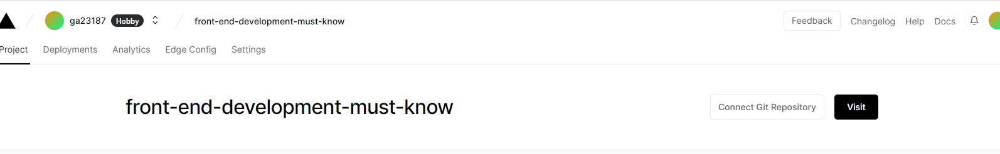
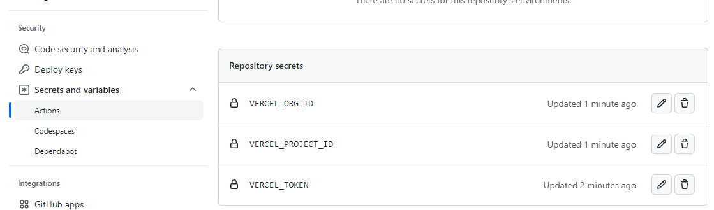

# 书籍在线

## github action 部署问题

- github action`Action failed with "The process '/usr/bin/git' failed with exit code 128"`
  
  - 搜索得到如下解释
    
    - 默认情况下，新存储库没有适当的工作流权限。
    
    解决办法
    
    - 转到存储库**Setting**
    - 选择**Actions**>>>**General**
    - 在"工作流权限(Workflow permissions)"中，选择`Read and write permissions`
    
    > 但是不是我这个部署失败的原因，点开发现里面是权限问题 403 了，不知道为啥 secrets.GITHUB_TOKEN 不能用来部署组织的仓库，明明提交代码都没得问题
    ```
    remote: Permission to tiger-book/front-end-development-must-know.git denied to github-actions[bot].
    fatal: unable to access 'https://github.com/tiger-book/front-end-development-must-know.git/': The requested URL returned error: 403
    ```
    
  - 查询发现组织下的仓库默认的`GITHUB_TOKEN`权限是只读的，没有写入权限，可见[为组织设置 `GITHUB_TOKEN` 的权限](https://docs.github.com/zh/enterprise-cloud@latest/organizations/managing-organization-settings/disabling-or-limiting-github-actions-for-your-organization#restrictions-and-behaviors-for-the-source-repository)
  
    解决办法有2种
  
    1. 通过在 GitHub.com 的右上角，单击你的个人资料照片，然后单击“你的组织”，在“工作流权限”下，选择是要让 `GITHUB_TOKEN` 对所有范围具有读写访问权限
    2. 通过编辑工作流文件中的 `permissions` 键来修改授予 `GITHUB_TOKEN` 的权限

## vercel 部署

> 部署组织下的仓库需要收费，可以免费体验 14 天
> Your trial expires in 14 days. To maintain access to premium features, upgrade to Pro.

> 可以登录网页，然后新建项目，选择仓库，拉取部署，
>
> 这里演示下项目下输入命令来完成部署。借助vercel 提供相对应的脚手架 **[CLI](https://vercel.com/docs/cli)** 供开发者使用。

- 安装`vercel`到项目中

  ```
  yarn add vercel
  ```

- `package.json`添加`script`

  ```
  "vercel": "vercel --prod"
  ```

  第一次将进行登录授权，选择对应平台，将会自动打开浏览器完成授权，接着将会确认一些信息，一般默认回车即可，下为执行结果

  ```
  λ npm run vercel
  
  > front-end-development-must-know@1.0.0 vercel
  > vercel --prod
  
  Vercel CLI 28.15.4
  ? Set up and deploy “E:\code\myProject\books\front-end-development-must-know”? [Y/n] y
  ? Which scope do you want to deploy to? ga23187
  ? Link to existing project? [y/N] n
  ? What’s your project’s name? front-end-development-must-know
  ? In which directory is your code located? ./
  Local settings detected in vercel.json:
  Auto-detected Project Settings (VitePress):
  - Build Command: vitepress build docs
  - Development Command: vitepress dev docs --port $PORT
  - Install Command: `yarn install`, `pnpm install`, or `npm install`
  - Output Directory: docs/.vitepress/dist
  ? Want to modify these settings? [y/N] n
  �  Linked to ga23187/front-end-development-must-know (created .vercel and added it to .gitignore)
  �  Inspect: https://vercel.com/ga23187/front-end-development-must-know/4FsxbcBeX46tQm8z3RFPSayGEMgn [4s]
  ✅  Production: https://front-end-development-must-know-pink.vercel.app [1m]
  ```

  执行完毕后，将会在根目录创建.vercel 文件夹，其中 project.json 中存放 orgId 和 projectId，下面将会用到。此时在[dashboard](https://vercel.com/dashboard)中也能看到该项目被部署了。

  不过这样部署上去的代码，并不会连接 git 仓库，需要到控制台中选择仓库。

  

  如果想在 github actions 中使用，则新建一个 steps，并到github上设置好对应的变量。

  

  其中还有一个 VERCEL_TOKEN 需要到 [Vercel Settings Tokens](https://vercel.com/account/tokens) 新建一个 Token。

  ```yaml
      - name: Deploy to Vercel
          run: npx vercel --token ${{secrets.VERCEL_TOKEN}} --prod
          env:
              VERCEL_TOKEN: ${{ secrets.VERCEL_TOKEN }}
              VERCEL_PROJECT_ID: ${{ secrets.VERCEL_PROJECT_ID }}
              VERCEL_ORG_ID: ${{ secrets.VERCEL_ORG_ID }}
  ```

