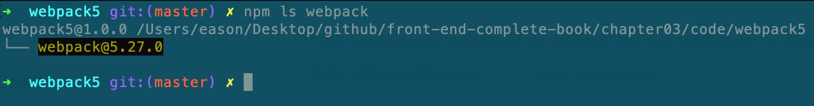
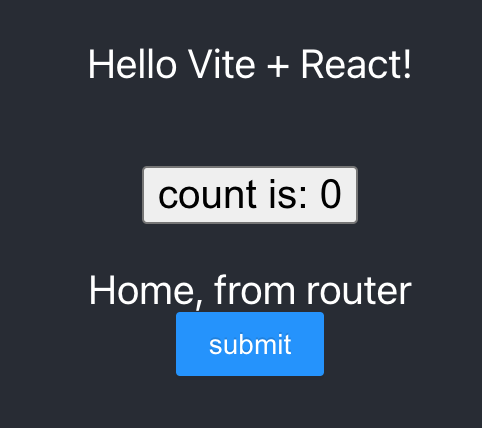
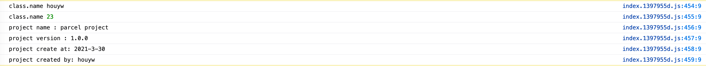

# 第 3 章 前端必会的构建工具实战

前端工程化在前端开发中变得越来越重要，特别是在前端组件陡增、开发规范日益完善、越来越追求开发效率的今天，怎样做好前端工程化是摆在每个前端开发人员面前的一个比较有挑战的任务。本章详细介绍目前在前端开发中比较常见的几种构建工具，通过实例介绍如何处理日常构建问题。本章的主要内容如下：

1. “经典”Webpack5 新特性。

2. Vite 构建实战。

3. rollup 实战。

4. parcel 实战。

## 3.1 “经典”Webpack5 新特性

Webpack 4 于 2018 年 2 月发布，这个版本引入了大量非常实用的特性，使得性能得到大幅提升，主要包含对 node 低版本的舍弃，最低支持 Node 8.9.4。从 Node 官网公布的数据来看，Node V6 已经支持了 93%的 ES6 特性，所以方便用 ES6 写出更健壮的代码。再者就是 mode 属性的支持，

```
"scripts": {
  "dev": "webpack --mode development",
  "build": "webpack --mode production"
}
```

当然 mode 也可以在 Webpack 的配置文件中进行配置。通过 mode， 我们可以轻松设置打包环境。如果把 mode 设置成 development，那么将获得良好的开发阶段体验。这得益于 Webpack 针对开发模式提供的特性：

- 支持浏览器调试工具。
- 模块缓存，避免在没更改的时候构建。
- 注释、开发阶段的详细错误日志和提示。
- 快速和优化的增量构建机制。

如果把 mode 设置成 production，则 Webpack 会专注项目的部署，包括以下特性：

- 开启所有的优化代码。
- 更小的 bundle 大小。
- 去除掉只在开发阶段运行的代码。
- Scope Hoisting 和 Tree Shaking。

除上述特性外，v4 还优化了许多插件，可以在 optimization.splitChunks 和 optimization.runtimeChunk 中完成大部分的优化项。当然，还有更多的特性支持（如 webassembly 开箱即用），以及更多 module 支持。

v4 版本从刚开始到 2020 年 10 月 10 日发布的 V5 版本经历 2 年多的时间，在没有重大更新的情况下，推出了很多功能。作为发布 Webpack5 这个大版本来说，新特性自然不会缺席，现在我们就开始捋一下有哪些比较实用的功能。

Webpack 5 主要更新了以下内容：

- 通过持久化硬盘缓存提升构建性能。
- 通过更好的算法改进长期缓存。
- 通过更好的 Tree Shaking 能力和代码的生成逻辑来优化 bundle 的大小。
- 改善 Web 平台的兼容性。
- 清除了内部结构，在 Webpack4 没有重大更新而引入一些新特性时所遗留下来的一些奇怪的 state。
- 通过引入一些重大的变更为未来的一些特性做准备，使得能够长期地稳定在 Webpack 5 版本上。

先通过一个简单的例子看下 bundle 包有什么明显的变化，先来看看两个 Webpack 版本（v4 和 v5 的配置保持一致）的基本配置。

```
// webpack.config.js
module.exports = {
  mode: 'development',
  entry: {
    index: './src/scripts/index.js'
  },
  output: {
    filename: '[name].js',
    path: path.resolve(__dirname, '../dist'),
  }
}
```

这个是最基本的配置，在 entry 文件中输入简单的控制台输出。

```js
console.log('hello,webpack4 ')
```

> 可以通过 **npm ls webpack** 命令查看已经安装包的版本，如图 3-1 和图 3-2 所示。



图 3-1


图 3-2

接下来在 package.json 中配置 script：

```js
"scripts": {
    "build": "rm -rf dist/ && webpack --config config/webpack.config.js --progress"
 }
```

配置之后，我们开始编译这两个工程:

```js
yarn run build
```

先看五两个版本打包后文件大小：

v5

```
asset index.js 1.26 KiB [emitted] (name: index)
```

v4

```js
index.js   6.26 KiB      index  [emitted]  index
```

仅从文件大小来看，Webpack5 打包后的文件明显小了很多。因为在 Webpack 5 的版本中去掉了很多模块管理代码，因此代码清爽了很多，如下所示。

```js
/*
 * ATTENTION: The "eval" devtool has been used (maybe by default in mode: "development").
 * This devtool is neither made for production nor for readable output files.
 * It uses "eval()" calls to create a separate source file in the browser devtools.
 * If you are trying to read the output file, select a different devtool (https://webpack.js.org/configuration/devtool/)
 * or disable the default devtool with "devtool: false".
 * If you are looking for production-ready output files, see mode: "production" (https://webpack.js.org/configuration/mode/).
 */
/******/ (() => { // webpackBootstrap
/******/ 	var __webpack_modules__ = ({

/***/ "./src/scripts/index.js":
/*!******************************!*\
  !*** ./src/scripts/index.js ***!
  \******************************/
/***/ (() => {

eval("console.log(\"hello,webpack5\")\n\n//# sourceURL=webpack://webpack5/./src/scripts/index.js?");

/***/ })
```

下面看一下另一个比较实用的配置：splitChunks 和 module size。

在 Webpack4 版本中，通常在 optimization 中这样配置：

```
optimization: {
    splitChunks: {
      cacheGroups: {
          commons: {
            chunks: 'all',
            name: 'commons',
            minChunks: 1,
            minSize: 10,
            maxSize: 20
          }
      }
    }
  }
```

与显示单个数字和具有不同类型的尺寸相比，模块现在有了更好的方式表示不同 size 的能力。 现在，SplitChunksPlugin 知道如何处理这些不同的 size，并将它们用于 minSize 和 maxSize。 默认情况下，仅处理 javascript 的大小。

```js
optimization: {
    splitChunks: {
      cacheGroups: {
        commons: {
          chunks: 'all',
          name: 'commons',
        }
      },
      minSize: {
        javascript: 0,
        style: 0,
      },
      //最大的文件，超过之后继续拆分
      maxSize: {
        javascript: 1,
        style: 3000,
      }
    }
  }
```

### 1.持久化缓存

在 Webpack 5 中增加了一个显示指定缓存的配置：

```javascript
cache: {
    type: 'filesystem',
    // 自定义缓存目录，
    cacheDirectory: path.resolve(__dirname, '.cache_file'),
    buildDependencies: {
      // 添加项目配置作为构建依赖项，以便配置更改时缓存失效
      config: [_cacheFileName],
      // 如果还有构建依赖其他内容，在此处添加
      //注意，在配置中引用的Webpack 、加载器和所有模块都会被自动添加进来
    }
  },
```

开启 cache 选项，可以有效地提升 Webpack 的打包速度。缓存将默认存储在 `node_modules/.cache/webpack`（使用 node_modules 时）或 `.yarn/.cache/webpack`（当使用 Yarn PnP 时）中。

在介绍 Yarn PnP 之前，我们先介绍下人们在处理 npm 包依赖所做的努力，到笔者截稿为止，npmjs 官网已经有 1,566,922 个 npm 包，现在的前端工程非常依赖这些功能各异的包。在 npm3 之前，node_modules 中的包一直以包嵌套的方式存在，这导致目录结构非常的深。在 npm3 之后就变成了扁平结构，由原来的 A 依赖 B，B 依赖 C，变成了 A 依赖 B、C，B 和 C 会安装到同级目录。

但是依赖平铺却无法解决 node_modules 包臃肿的问题，一个中大型的项目，动辄上百兆。这就导致三个问题：

（1）一个是占用大量的磁盘空间。

（2）二是会占用不必要的带宽。

（3）就是依赖管理方式效率太低，不仅在引用依赖时速度慢，在安装依赖时速度也慢。

前两个问题不难理解，不再赘述。下面对第三问题进行解释，而这又涉及两个问题，即 node 包引用的解析和安装依赖的过程。

node 包引用的过程是这样的：在 require 的一个核心模块或者本地相对路径，可直接使用该文件，否则就在当前目录下寻找 node_modules，如果没有，则到父目录查找，依次类推，直到查找到系统根目录。在找到 node_modules 目录之后，再在该目录中寻找名为 moduleName.js 的文件或是 moduleName 的子目录，这个过程涉及代价不小的 I/O 操作。

安装依赖时，yarn1.x 版本的 yarn install 操作会执行以下 4 个步骤：

1. 解析 npm 包具体的版本号并搜集依赖信息（Resolving packages）。
2. 如果缓存中无相应版本，就下载对应版本依赖的 tar 包到本地离线缓存（Fetching packages）。
3. 将依赖从离线镜像解压到本地缓存，并拷贝到当前目录的 node_modules 中（Linking dependencies）。
4. 执行 install 相关的生命周期钩子（Building fresh packages）。

这个过程同样涉及大量的文件 I/O 操作，导致安装依赖时效率不高。

后来 yarn 和 npm 都开始支持缓存，才让这种情况有所缓解。但是还不够彻底。如何才能比较彻底的解决呢，这就是要介绍的 Yarn PnP。PnP 的全称 Plug'n'P ，直译就是“即插即用”，核心思想是在每台机器上，单独创建一个包目录，来管理所有依赖的 npm 包。既然是中心化的管理思想，那么一台机器上的包就不需要重复安装了，在项目运行时，先在中心化目录中对依赖包进行 resolve，然后再进行启动。

接下来看看是怎样用的。

首先，全局安装 yarn（最低需要 1.12 版本）。

```
npm install -g yarn
```

也需要在 package.json 配置，也可以通过 yarn --pnp 开启（yarn --disable-pnp 关闭），

```json
// package.json
{
  ...
  "installConfig": {
    "pnp": true
  }
}
```

我们先把 node_modules 删掉，再执行**yarn install** , 发现不再有 node_modules 生成，取而代之的是一个`.pnp.js`文件。这是一个 node 程序，该表中包含了以下信息：

- 项目需要依赖包的版本信息、依赖树信息
- 依赖包模块查找算法
- 依赖包在文件系统中的具体位置

在 PnP 模式下安装依赖 Yarn 不会把依赖包拷贝依赖到 `node_modules` 目录，只是在.pnp.js 中记录相关的缓存信息。这种方式就避免了 node_modules 的困扰，并且提高了模块的加载效率，Node 为了查找模块, 需要进行大量的 stat 和 readdir 系统调用，而 pnp 直接定位到指定的目录然后加载文件。

PnP 机制同时也解决了在 node_modules 下不能保留同一个包不同版本的问题。但是需要注意的是，虽然该模式陆续在前端的工具中慢慢得到了支持，如：Babel（V1.9）、Parcel（2.0），Rollup（1.9），TypeScript（借助插件支持），WebPack（5+），ESBuild 等。但是针对存量项目的 PnP 模式的支持恐怕受业务的限制望而却步。

### 2.真实内容哈希

当 output 中的 filname 使用 `[contenthash]` 时，Webpack4 仅使用文件内部结构的哈希。Webpack5 是文件内容真实哈希，如果是仅修改注释或重命名变量，Webpack5 是可以监测到文件变化的，而 Webpack4 监听不到变化。

### 3.命名代码块 ID

Webpack5 默认在开发模式下启用了新命名的 module ID 算法，该算法提供了 chunks（和文件名）开发人员可读的引用方式。 module ID 由其相对于上下文的路径确定。 chunk ID 由 module 的内容确定。例如，src_demo1_data_js.js，因此在开发调试 chunk 时不再需要像下面这样使用：

```
import(/* WebpackChunkName: "name" */ "module")
```

而是直接

```
import("module")
```

当然，也可以在生产环境安全的前提下使用 ，需要在 optimization 设置`chunkIds: "named"` 。如果你不喜欢在开发中改变文件名，你可以通过 `chunkIds: "natural"` 来使用旧的数字模式。

### 4.支持全新的 Node.js 生态特性

这部分主要包含两部分，一是 Yarn PnP，该特性在前面已经做了解释。二是支持 package.json 中的 exports 和 imports 字段。

package.json 中的 exports 字段允许先声明再使用，比如“import crypto-test” 或“import crypto-test/sub” 。 这种实现方式替换了导入模块时默认返回包的 index.js 文件。

比如下面的配置：

```
{
  "exports": {
    ".": "./main.js",
    "./sub/path": "./secondary.js",
    "./prefix/": "./directory/",
    "./prefix/deep/": "./other-directory/",
    "./other-prefix/*": "./yet-another/*/*.js"
  }
}
```

对应的导出结果如表 3-1 所示。

| 模块标识                               | 查找文件结果                                 |
| :------------------------------------- | :------------------------------------------- |
| `.` 不能省略，和原配置 main 的含义相同 | `package/main.js`                            |
| `package/sub/path`                     | `package/secondary.js`                       |
| `package/prefix/some/file.js`          | package/directory/some/file.js               |
| `package/prefix/deep/file.js`          | `package/other-directory/file.js`            |
| `package/other-prefix/deep/file.js`    | `package/yet-another/deep/file/deep/file.js` |
| `package/main.js`                      | Error                                        |

表 3-1

如果没有对应的配置，就会报错，如上面的 package/main.js。

我们先定义一个实例 module，将目录命名为 encrypt-test, 并新建一个 package.json，name 和目录名保持一致。

```
{
  "name": "encrypt-test"
}
```

目录结构如图 3-3 所示。


图 3-3

接下来建一个主文件 encrypt.js，并输入示例代码：

```js
module.exports = function () {
  console.log('packages/encrypto.js')
}
```

在根目录下建立子目录 libs，并建立子包需要的文件 trim.js：

```js
module.exports = function (str) {
  return str.replace(/\s+/g, '')
}
```

在 package.json 中配置 exports：

```js
{
  "name": "encrypt-test",
  "exports": {
    ".": {
      "browser" : {
        "default": "./encrypt.js"
      },
      "require": "./encrypt.js",
      "import": "./encrypt.js"
    },
    "./trim" : {
      "browser" : {
        "default": "./libs/trim.js"
      }
    }
  }
}
```

先配置一个.，这个是必须配置的，它代表 main 字段配置。browser 代码支持浏览器，require 表示以 require()方式引入，import 代表"import xx from ..."引用方式。

有了上面的配置之后，就可以在 js 文件中以如下方式引用改包了：

```js
import encryptTest from 'encrypt-test'
import trim from 'encrypt-test/trim'
```

### 5.经过优化的构建目标（target）

Webpack 5 允许传递一个目标列表，并且支持目标的版本。例如：

```
target: "node14"
target: ["web", "es2020"]
```

### 6.Web 平台特性支持

（1）图片导入：Webpack 5 已经对资源模块提供了内置支持，这些模块可以在输出文件夹中生成一个文件。在导入图片时，无需借助 file-loader、url-loader 和 raw-loader, 在 Webpack5 中简单配置即可。

```js
module.exports = {
  output: {
    assetModuleFilename: 'images/[name].[hash:5][ext]',
  },
  module: {
    rules: [
      {
        test: /\.(png|jpg|svg)$/,
        type: 'asset',
      },
    ],
  },
  experiments: {
    asset: true,
  },
}
```

（2）异步引入。Wepback4 是这样导入异步代码的：

```js
import('./entry').then((res) => {
  console.log(res)
})
```

但是，在 Wepback 4 中，无法导入由 async/await 实现的的模块：

```js
// async.js
let output
async function main() {
  const dynamic = await import('./data')
  output = dynamic + 'from aysnc'
}
main()
export default output

// index.js
import output from './async'
console.log(output) // undefined
```

在 Webpack 5 中修复了这个问题，开启 topLevelAwait 就可以实现，并且无须在外面包裹 async，代码如下所示：

```js
// async.js
const dynamic = await import('./data');
const output = dynamic 'from aysnc';
export default output;
```

（3）Webassembly 更方便支持。我们先把两个数相加的工具方法生成一个 wasm 文件 utils.wasm，如果对 webassembly 不是很熟悉，可先学习 6.6，了解相关的内容。

```go
func add(a,b int) int {
	return a+b
}
```

在 ebpack4 中不能同步地加载，否则会报错，更不能把 wasm 当成主 chunk。

```
import('path/utils.wasm').then(_ => {
   console.log(_.add(4, 6));
});
```

而在 Webpack 5 之后，只要开启 syncWebAssembly 和 syncWebAssembly 后，就可以像导入一个普通的模块那样使用了：

```js
//webpack.config.js
module.exports = {
  experiments: {
    asyncWebAssembly: true,
    syncWebAssembly: true,
  },
}

//index.js
import { add } from './utils'
console.log(add(4, 6))
```

（4）webpack-dev-server 的改进。Webpack5 中使用 dev server 更加方便，在安装完 npm 包之后，不需要要在 Webpack 配置文件中引入该插件，只需在 package.json 的 scripts 中加上 serve 参数即可使用该插件：

```js
webpack serve --config config/webpack.config.js --open
```

### 7.模块联邦

在 Webpack 5 之前可以通过 DLL 或者 Externals 做代码共享，不足之处是做不到跨项目和应用共享，更做不到热拔插。Webpack 5 中的模块联邦就是为了解决这类问题而诞生的。通过该机制，可以让构建后的代码库以**\*\*动态的\*\***、**\*\*运行时的\*\*\*\*\***\*方\***\*\***\*式\*\*\*\*在另一个代码库中运行。通过细化功能模块、组件复用、共享第三方库、线上加载 npm 包等方式，可以更好地服务于多页应用、微前端等开发模式。

Webpack 5 提供了一个名为 ModuleFederationPlugin 的插件来实现该机制，需要配置的参数如下：

name：必传且唯一，第三方引用关键名称。

library：声明一个挂载在全局下的变量名，其中 name 即为 umd 的 name。

filename：构建后的 chunk 名称。

Exposes： 作为被引用方最关键的配置项，用于暴露对外提供的 modules 模块。

shared： 声明共享的第三方资源。

我们接下来通过一个简单的实例来实战一把。新建两个工程 App1 和 App2，在 App2 中暴露一定的模块在 App1 中使用。App2 的目录结构如下所示。

```
├── package.json
├── public
|  └── index.html
├── src
|  ├── app.js
|  ├── components
|  └── index.js
├── webpack.config.js
└── yarn.lock
```

配置 webconfig.config.js（省略部分配置），端口暴露为 3001：

```js
const { ModuleFederationPlugin } = require('webpack').container;

module.exports = {
  entry: './src/index',
  mode: 'development',
  devServer: {
    contentBase: path.join(__dirname, 'dist'),
    port: 3001,
  },
  output: {
    publicPath: "http://localhost:3001/",
  },
  module: {
    ...
  },
  plugins: [
    new ModuleFederationPlugin({
      name: 'app2',
      library: { type: 'var', name: 'app2' },
      filename: 'remoteEntry.js',
      exposes: {
        './Counter': './src/components/Counter',
      },
      shared: ['react', 'react-dom'],
    })
  ],
};


```

需要注意的是 filename，它是暴露出去的 chunk 名称，也就是说，通过这个 name 可以远程访问。接下来，在 src/components 中声明一个要暴露出去的展示组件：

```jsx
import React from 'react'

function Counter(props) {
  return (
    <>
      <p>Count: {props.count}</p>
      <button onClick={props.onIncrement}>Increment</button>
      <button onClick={props.onDecrement}>Decrement</button>
    </>
  )
}
```

至此，App2 工程新建完毕。下面看一下 App1 的配置。先将 Webpack .config.js 的端口设置为 3000：

```js
const { ModuleFederationPlugin } = require('webpack').container

module.exports = {
  devServer: {
    contentBase: path.join(__dirname, 'dist'),
    port: 3000,
  },
  output: {
    publicPath: 'http://localhost:3000/',
  },
  module: {
    省略,
  },
  plugins: [
    new ModuleFederationPlugin({
      name: 'app1',
      library: { type: 'var', name: 'app1' },
      remotes: {
        appAlias: 'app2',
      },
      shared: ['react', 'react-dom'],
    }),
  ],
}
```

需要注意的是，在 ModuleFederationPlugin 中设置 remote，指定依赖的远程库，并给远程库起一个别名 appAlias。除此之外，还需要在 index.html 中引入远程库：

```
<script src="http://localhost:3001/remoteEntry.js"></script>
```

下面在 App1 中新建一个组件用例，测试一下远程组件是否真的生效。在 src 下新建一个 app.js：

```jsx
const Counter = React.lazy(() => import('appAlias/Counter'))

function App() {
  const [count, setCount] = useState(0)
  return (
    <>
      <React.Suspense fallback="Loading Counter...">
        <Counter
          count={count}
          onIncrement={() => setCount(count + 1)}
          onDecrement={() => setCount(count - 1)}
        />
      </React.Suspense>
    </>
  )
}
```

万事俱备，现在可以把两个应用启动一下看看效果了，如图 3-4 所示。


图 3-4

## 3.2 “新秀”Vite 构建实践

2021 年 2 月 17 日，Vite2.0 发布了，在前端圈引起了 不小的轰动。至于引起轰动的原因恐怕要数官网上介绍的这几点原因：

- 去掉打包步骤，快速的冷启动。
- 及时的模块热更新，不会随着模块变多而使得热更新变慢。
- 真正的按需编译。

Vite 是基于浏览器 native 的 ES module 开发的，基于 Bundleless 思想。在了解 Vite 前，需要先了解 Bundle 和 Bundleless。Bundle 和 Bundleless 是两种开发方式，自 2015 年 ESM 标准发布后，这两种开发方式就逐渐明确。

在日常开发中，一般是使用 Webpack 对代码进行编译，并打包生成 Bundle 文件。其原因如下：

- 很多应用都是运行在 HTTP/1.1 上，并且各浏览器有连接限制。
- 浏览器不支持的模块系统不能直接运行，如 CommonJS。
- 新的语法浏览器不识别。
- 代码依赖关系与顺序管理。

但是，在项目达到一定的规模后，基于 Bundle 构建优化的收益就变得越来越有限，无法实现质的提升。Webpack 变慢的主要原因是，它将各个资源打包整合在一起形成 Bundle，项目规模越大，资源就越多。是否可以不用打包直接在浏览器中执行代码呢？当然可以，这就是 Bundleless。如图图 3-5 所示。


图 3-5

在 Bundleless 模式下，应用不再需要构建成一个完整的 Bundle，修改文件时也不需要重新生成 Bundle 文件，浏览器只需要重新加载单个文件即可。 也就是说，只需要刷新即可即时生效。如果有 HotModuleReplace 等相关技术加持，则可以实现完美的开发体验。

实现 Bundleless 一个很重要的前提是模块的动态加载能力，实现这个功能主要的思路有两个：

- 使用 System.js 之类的 ES 模块加载器，优点是具有很好的模块兼容性。
- • 直接利用标准的 ES Module。该 module 实现已经标准化，并且各个浏览器厂商也已纷纷支持（Edge79，Firefox 67，Chrome63, Safari11.1 和 Opera50, 这是几个浏览器支持 ES module 的最低版本 ）。相信以后前端同时整体架构在各种标准化的基础上也会变得更加简单。

Bundle 和 Bundleless 的对比如表 3-2 所示

|          | Bundle                            | Bundleless                               |
| -------- | --------------------------------- | ---------------------------------------- |
| 启动时间 | 时间较长                          | 短，只启动 Server ，其他可按需加载       |
| 构建时间 | 随项目体积线性增长                | 构建时间复杂度 O(1)                      |
| 加载性能 | 打包后加载对应的 Bundle           | 请求映射的本地文件                       |
| 缓存能力 | 缓存利用率一般，受 split 方式影响 | 缓存利用率近乎完美                       |
| 文件更新 | 重新打包                          | 重新请求单个文件                         |
| 调试体验 | 需要 SourceMap                    | 不强依赖 SourceMap，可对单个文件进行调试 |
| 生态     | 比较完善                          | 目前相对不成熟，但是方案已越来越多       |

表 3-2

基于 ES module 的构建，其实 Vite 并不是首创，同样的实践在之前有类似的轮子，如 esbuild、snowpack、es-dev-server 等。下面通过实例讲解 Vite 是如何进行开发的。

与常见的开发工具一样，Vite 提供了用 npm 或者 yarn 一键生成项目结构的方式。这里使用 yarn 生成一个 React 项目：

```js
yarn create vite-app vite-project
cd vite-project
yarn install
```

目录结果如图 3-6 所示。

```js
├── index.html
├── node_modules
├── package.json
├── src
|  ├── App.css
|  ├── App.jsx
|  ├── api
|  |  ├── request.js
|  |  ├── serviceApi.js
|  |  └── urlConfig.js
|  ├── constants
|  |  └── statusCode.js
|  ├── contanier
|  |  ├── home
|  |  └── main
|  ├── favicon.svg
|  ├── index.css
|  ├── logo.svg
|  ├── main.jsx
|  ├── routers
|  |  ├── history.js
|  |  └── index.js
|  └── utils
├── vite.config.js
└── yarn.lock
```

图 3-6

index.html 为页面入口，main.jsx 为系统主入口，vite.config.js 为配置文件，该文件可以类比 vue 项目的 vue.config.js。

在项目开始之前，先引入几个项目核心库：核心库 react-router-dom 和 history， UI 库 ant design，ajax 库 axios 和 css 预处理器 Less。

第 1 步，配置组件库，因为在后面的组件中会用到 UI 组件。注意，组件库可以在配置文件中引入，而不是在 main.jsx 中引入。如果在 main.jsx 中引入，则在创建项目时构建工具会把整个 CSS 文件全部引入，这是没有必要的，所以尝试按需加载。

Vite 需要借助插件 vite-plugin-imp 来按需加载：，

```js
yarn add vite-plugin-imp -D
```

在 vite.config.js 中配置插件：

```js
import vitePluginImp from 'vite-plugin-imp'
 plugins: [
    vitePluginImp({
      libList: [
        {
          libName: "antd",
          style: (name) => `antd/lib/${name}/style/index.less`,
        },
      ],
    })
  ],
   css: {
    preprocessorOptions: {
      less: {
        // 支持内联 JavaScript
        javascriptEnabled: true,
      }
    }
  }
```

CSS 预处理器提取公有 css 变量及 css 函数并放在一个文件中，所以确认增加以上配置。并且配置 javascriptEnabled 为 true，支持 less 内联 JS。

另一个比较实用的功能是自动刷新，Vite 也没有掉队，借助插件@vitejs/plugin-react-refresh 即可实现：

```js
import reactRefresh from '@vitejs/plugin-react-refresh'
plugins: [reactRefresh()]
```

短路径配置：

```js
resolve: {
    alias: {
      "@": path.resolve(__dirname, 'src')
    }
 },
```

代理配置：

```js
server : {
    proxy: {
      '/api': {
        target: 'http://jsonplaceholder.typicode.com',
        changeOrigin: true,
        rewrite: (path) => path.replace(/^\/api/, '')
      }
    }
  }
```

环境参数配置

在日常开发中，有些代码或者配置是要区分环境的。在 Webpack 中可以在 scripts 中定义 NODE_ENV 或者在 webpack .config.js 中定义 DefinePlugin 区分环境。在 Vite 中，可以在 scripts 中定义 mode 实现：

在 vite 中可以通过在 scripts 中定义 mode 实现：

```js
"dev": "vite --mode development",
```

```js
//环境值
const env = process.argv[process.argv.length - 1]
console.log('当前环境：', env) // development
```

我们先在 container 目录下新建两个组件： home 和 main。当 path 为“/”时是渲染 home 组件的，当 path 为“/main”时是渲染 main 组件的：

```jsx
// container/home/home.jsx
import { Button } from 'antd'
function Home() {
  return (
    <div>
      <div>Home, from router</div>
      <Button type="primary">submit</Button>
    </div>
  )
}
//container/main/index.jsx
function Main() {
  return <div>Main, from router</div>
}
```

有了组件之后，下面开始配置 router，在 routers 目录下建立 index.js：

```js
import Home from '@/contanier/home'
import Main from '@/contanier/main'
export default [
  {
    path: '/',
    component: Home,
  },
  {
    path: '/main',
    component: Main,
  },
]
```

定义配置后，需要在 app.jsx 中遍历这个数组，生成路由配置：

```jsx
//app.jsx
import { BrowserRouter as Router, Route, Switch } from 'react-router-dom'
import routes from './routers'
function App() {
  const [count, setCount] = useState(0)
  return (
    <Router>
      <div className="App">
        <header className="App-header">
          // 省略部分代码
          <Switch>
            {routes.map((route) => (
              <Route exact key={route.path} path={route.path}>
                <route.component />
              </Route>
            ))}
          </Switch>
        </header>
      </div>
    </Router>
  )
}
```

先启动项目，看看效果，如图 3-7 所示。

```
yarn run dev

vite v2.1.2 dev server running at:
  > Local:    http://localhost:3000/
  > Network:  http://192.168.1.6:3000/
  > Network:  http://192.168.192.196:3000/

  ready in 1982ms.
```



图 3-7

然后再输入 `http://localhost:3000/main`，效果如图 3-8 所示。


图 3-8

有了页面组件之后，就需要考虑 AJAX 请求的事儿了，否则页面是没有灵魂的。在 api 目录下新建 request.js，先对 axios 做一层封装，配置 request 和 response 拦截器，这也是前端开发里面的通用做法。

```js
import axios from 'axios'
import StatusCode from '@/constants/statusCode'

const instance = axios.create({
  baseURL: '',
  timeout: 50000,
  xsrfCookieName: 'xsrf-token',
})
//请求拦截器，如果需要在hearder中增加一些参数，则可以在这里统一处理
instance.interceptors.request.use(
  (config) => {
    return config
  },
  (error) => {
    return Promise.reject(error)
  }
)
// 添加一个响应拦截器，对每次返回的数据进行拦截，并进行业务判断
instance.interceptors.response.use(
  (response) => {
    return Promise.reject(response.data)
  },
  (error) => {
    return Promise.reject(error)
  }
)
```

axios 拦截器为我们的日常开发提供了很多便利，如果需要在每个请求中增加相同的参数，则可以在 request 拦截器中进行配置。如果是统一处理返回的数据，如无权限、404、没有登录等这种通用场景，则可以统一在 response 的拦截器中进行处理。

以上是 Vite 配合 React 开发的基本配置，大家可以上手一试。

## 3.3 小巧的 Rollup 实践

Rollup 是一个 JavaScript 模块打包器，它可以将小块代码编译成大块复杂的代码。当用 ES2015 及其以后的规范来编写应用或者库时，也可以很方便打包。打包成为一个单独文件供浏览器和 Node.js 使用。从这个角度讲，它和 browserify、Webpack、gulp 有几分相似。

为了更好地说明 Rollup 的应用场景，下面先简单比较一下 Rollup 和 Webpack ：

- • Webpack 天然支持 code spliting 和 HRM，Rollup 却不支持。
- Rollup 打包后的代码体积更小，Webpack 4 版本的 Bundle 中有大量的模块适配代码。
- Rollup 是基于 ES2015 模块的，比 Webpack 所使用的 CommonJS 模块更有效率。另外， Rollup 还支持 tree_shaking（ES 模块中支持 ），这意味着在最终的 Bundle 中只有我们实际需要的代码
- Webpack 更适合做应用开发，Rollup 更适合打包库。

下面通过一个简单的加密解密案例介绍 Rollup 的用法。

目录如图 3-9 所示。

```js
├── node_modules
├── package-lock.json
├── package.json
├── rollup.config.js
├── src
|  ├── scripts
|  |  ├── main.js
|  |  ├── modules
|  |  └── utils
|  └── styles
└── yarn.lock
```

图 3-9

先使用 yarn 命令生成 package.json：

```js
yarn init -y
```

再新建一个 rollup.config.js,这是 Rollup 要求的配置文件，在 package.json 中指定该配置启动：

```js
//package.json
"build": "cross-env NODE_ENV=production rollup --config",
```

```js
module.exports = {
  input: 'src/scripts/main.js',
  output: {
    file: 'dist/encrypt.min.js',
    format: 'umd',
    name: 'encrypt',
    sourceMap: 'inline',
  },
}
```

先初始化一个基本的 rollup 配置，指明入口文件和输出文件。input 比较好理解，指的是 rollup 启动时需要执行的文件。下面对 output 中的字段进行说明，它允许传入一个对象或者一个数组。当传入数组时，可依次输出多个文件。

- file：输出文件的详细路径。
- format：Rollup 支持多种输出格式。因为要兼容其他模式，所以这里指定为”UMD“格式。其他可选 的格式有 cjs（commonjs）、,esm(ES module)、 system、amd 和 iife。
- name：输出文件名。
- sourceMap ：如果有 sourcemap 的话，那么调试代码时会比较轻松，这个选项会在生成文件中直接添加 sourcemap。

接下来介绍几款插件。

（1）babel 插件 rollup-plugin-babel，。该插件的主要作用是编译 ES6 的语法为 ES5，让浏览器可以识别。

```js
yarn add @rollup/plugin-babel -D
```

在 rollup.config.js 中增加 plugin 配置：

```js
//rollup.config.js
import babel from '@rollup/plugin-babel'
plugins: [babel()]
```

还需要增加 babel 配置，在.babel 文件中增加如下代码：

```json
{
  "presets": [
    [
      "@babel/preset-env",
      {
        "modules": false //Enable transformation of ES6 module syntax to another module type
      }
    ]
  ]
}
```

（2）rollup-plugin-node-resolve 插件。因为默认打包后的 bundle.js 仍然在 Node.js 中工作，为了解决这个问题，我们需要把代码与依赖的第三方库进行合并。

```js
import resolve from '@rollup/plugin-node-resolve'
plugins: [resolve()]
```

（3）commonjs 插件。rollup.js 编译源码中的模块引用默认只支持 ES6+的模块方式 import/export，但是有大量的 npm 模块是基于 CommonJS 模块方式的，这就导致大量的 npm 模块不能直接编译使用。

```js
import commonjs from '@rollup/plugin-commonjs'
plugins: [commonjs()]
```

（4）json 插件。在本书的实例中，我们会根据 package.json 生成加密和解密的密钥：

```js
const hash = require('content-hash')
function generatorKey() {
  let es = hash.encode('swarm-ns', fs.readFileSync('../../../package.json'))
  key = Buffer.from(es.substring(0, 16), 'utf8')
  iv = Buffer.from(es.substring(2, 18), 'utf8')
}
```

在 rollup 中加载 JSON 文件时需要@rollup/plugin-json 插件的协助：

```js
import json from '@rollup/plugin-json'
plugins: [json()]
```

有了上面的插件之后，Rollup 的基本构建就已经成型了，下面看一下具体的加密和解密代码。

```js
const crypto = require('crypto')
const fs = require('fs')
const hash = require('content-hash')
const util = require('../utils/util')

//128-cbc需要定义16位的key和iv
let key = ''
let iv = ''
//加密方式
const DEFAULT_CRYPTO_TYPE = 'aes-128-cbc'
const UTF8_TYPE = 'utf8'
const HEX_FORMAT = 'hex'

/**
 * 加密方法
 * @param {*} src ，需要加密的字符串
 */
function encrypt(src) {
  let sign = ''
  const cipher = crypto.createCipheriv(DEFAULT_CRYPTO_TYPE, key, iv)
  sign += cipher.update(util.trim(src), UTF8_TYPE, HEX_FORMAT)
  sign += cipher.final(HEX_FORMAT)
  return sign
}

/**
 * 解密方法
 * @param {*} sign,需要解密的字符串
 */
function decrypt(sign) {
  let src = ''
  const cipher = crypto.createDecipheriv(DEFAULT_CRYPTO_TYPE, key, iv)
  src += cipher.update(sign, HEX_FORMAT, UTF8_TYPE)
  src += cipher.final(UTF8_TYPE)
  return src
}

function generatorKey() {
  let es = hash.encode('swarm-ns', fs.readFileSync('../../../package.json'))
  key = Buffer.from(es.substring(0, 16), 'utf8')
  iv = Buffer.from(es.substring(2, 18), 'utf8')
}

generatorKey()

module.exports = {
  encrypt,
  decrypt,
}
```

这里使用是的 128 位 aes-128-cbc 加密方法，该加密方法有 17 位的 key 和 iv 向量。为了不暴露 key 和 iv，在 generatorKey 方法中，是通过生成 package.json 文件的内容 hash 值来计算出。

下面测试一下加密和解密是否起作用：

```js
const sign = encrypt('hello world')
console.log(sign)
console.log('加密后的长度：' + sign.length)
// 解密
const src = decrypt(sign)
console.log(src)
```

经过测试，符合我们的预期效果：

```
f09a42f0e4b7c667f3ba26e0d5d6e0b3
加密后的长度：32
helloworld
```

平时我们见到的工具包以压缩文件居多，压缩文件目的主要有两个，一是可以减少文件体积，二是可以隐藏代码实现。我们也按照这样的思路来，先安装插件 rollup-plugin-uglify，并在配置文件中进行配置：

```js
import { uglify } from 'rollup-plugin-uglify'
plugins: [process.env.NODE_ENV === 'production' && uglify()]
```

下面开始最终打包：

```js
yarn run build

$ cross-env NODE_ENV=production rollup --config
src/scripts/main.js → dist/encrypt.min.js..
created dist/encrypt.min.js in 2.6s
✨  Done in 5.84s.
```

## 3.4 零配置的 Parcel 实践

目前在前端有很多打包工具可供选择，如前面介绍的 Webpack 、Vite 和 Rollup，以及本节介绍的 parcel，还有老牌的 Grunt 和 gulp，甚至新秀 esbuild、swc，等等。

打包工具都是围绕着配置和 plugin 开始构建的。在配置文件中，总要安装一堆的 npm 包，配置文件更是需要手动配置入口文件、输出文件、开发服务器配置、proxy 代理、loader 配置、优化配置，等等，这样配置下来，代码常常会超过 100 行。这些配置不仅繁琐，而且耗时。parcel 被设计成零配置的：只需要将它指向应用程序的入口点，它就能正常工作。

Parcel 可以利用多核处理器编译多种语言及其工具链，并且速度极快，它获取所有文件和依赖项并进行转换，然后将他们合并为较小的 bundle 包。并且 parcel 让编译的包更好低移植，可以为不同的环境、web 服务器或应用程序构建代码。

Parcel 将一个入口点作为输入，在 Parcel 中定义了各种资源类型，它们知道如何处理特定的资源类型。资源文件被解析，它的依赖关系被提取，并转换成最终的编译形式。这创建了一个资源树。

一旦资源树被构建，资源就被放入一个 bundle 树中。为入口资源创建一个 bundle，并为动态导入的资源创建子 bundle，这回导致代码拆分的发生。当导入不同类型的资源的时候就会创建子 bundle，例如如果你在 js 中导入 css 文件，它就会打包成对应 js 的兄弟 bundle。如果一个资源需要多个 bundle，它会被打包到最近的共同父 bundle 中，因此它不会被包含多次。

在构建 bundle 树之后，每一个包都有特定的文件类型的包装器写入文件。

下面通过构建一个实例来讲解在日常开发中如何配置 Parcel 需要的组件。

新建一个 package.json，并安装 Parcel 核心包(（本节实例基于 Parcel 2.0.0-beta.2 版本）：

```
yarn init -y
yarn add parcel
```

在 package.json 的同级目录下新建 index.html 和 app.js，在 index.html 中引入 app.js，了解一点 web 开发都知道，这是最直接、最方便的加载 js 文件的方式：

```
<!DOCTYPE html>
<html lang="en">
<head>
  <title>parcel practise</title>
</head>
<body>
  <div class="app"></div>
  <script src="./app.js"></script>
</body>
</html>
```

为了验证方便，这里输入最简单的一句：

```
//app.js
document.writeln("hello,parcel<br>")
```

在 package.json 的 scripts 中配置 Parcel 也非常的简单，运行结果如图 3-10 所示。

```
 "start": "parcel index.html",
```


图 3-10

与预想的结果相同。这种开发方式确实能让人眼前一亮，既没有任何配置，也不用指定 loader 就可以运行。

接下来看看能否识别 import 和 ES6 语法：

```js
// src/scripts/index.js
export default {
  getCreateTime: () => {
    let d = new Date()
    return d.getFullYear() + '-' + (d.getMonth() + 1) + '-' + d.getDate()
  },
}
```

```js
// src/utils/index.js
const _package = require('../../package.json')
export default {
  projectName: 'parcel project',
  getAuthor: function () {
    return 'houyw'
  },
  getVersion: () => {
    return _package.version
  },
}
```

```js
// src/models/person.js
export default class Person {
  constructor(name, age) {
    this.name = name
    this.age = age
  }
  getName() {
    return this.name
  }
  getAge() {
    return this.age
  }
}
```

下面我们把这几个例子都导入 app.js 中测试一下：

```js
import name from './src/utils/index'
import ss from './src/scripts/index'
import Person from './src/models/person'
import './style.css'

const p = new Person('houyw', 23)
console.log('class.name', p.getName())
console.log('class.name', p.getAge())
console.log('project name :', name.projectName)
console.log('project version :', name.getVersion())
console.log('project create at:', ss.getCreateTime())
console.log('project created by:', name.getAuthor())
```

修改代码后，Parcel 的服务会自动重启，如下图 3-11 所示。



图 3-11

从测试结果来看，Parcel 并不需要配置 babel 就可以识别 import 并将 ES6 转成 ES5。这是因为在 Parcel 中已经预置了 babel 编译 @parcel-transform-babel，大部分内置插件都可以在 node_modules/@parcel 目录下找到。

在 Web 开发中，处理 CSS 文件是必不可少的。在 Parcel 中，也提供了比较清爽的处理方式：

```js
import './style.css'
```

对 scss 的支持是怎样的呢？在 style.css 的同级目录中新建 style.scss，并修改样式引入：

```scss
.app {
  width: 100px;
  height: 100px;
  border-radius: 5px;
  border: 1px solid #ccc;

  .title {
    color: red;
  }
}
```

重新启动服务后，页面报错，如图 3-12 所示。


图 3-12

这是因为 Parcel 没有预置 scss 预处理器，需要我们手动安装

```js
yarn add scss -D
```

重新编译，运行正常。

接下来看一下代理配置，这个配置在开发阶段会经常用到，主要有两方面的作用：（1）如果有单独的后端开发服务器 API，并且希望在同域名下发送 API 请求 ，那么这个配置会很有用。（2）解决最常见的开发环境的跨域问题。在开发过程中，开发环境一般都是 http://localhost，但是如果请求的接口不在本地，那么就要面对跨域请求的问题了。

在 Parcel 中配置 Proxy 的方式有两种：一种是新建.proxyrc 文件，该文件是以 JSON 的方式定义 Proxy 的。

```json
{
  "/api": {
    "target": "http://demo.test.com:8000/",
    "pathRewrite": {
      "^/api": ""
    }
  }
}
```

这个代理的含义是只要发起 `http://localhost:8080/api/getUsers` ，就会会被代理到`http://demo.test.com:8000/getUsers`。

另一种是如果配置比较复杂，则可以使用.proxyrc.js 文件，然后引入 http-proxy-middleware：

```js
const { createProxyMiddleware } = require('http-proxy-middleware')

module.exports = function (app) {
  app.use(
    createProxyMiddleware('/api', {
      target: 'http://demo.test.com:8000/',
      pathRewrite: {
        '^/api': '',
      },
    })
  )
}
```

下面看一下在 Parcel 中如何定义环境变量，以及在代码中是怎样获取环境变量的。

Parcel 使用[dotenv](https://github.com/motdotla/dotenv)支持从.env 文件加载环境变量，默认会安装 dotenv 包，所以可以通过新建 .env.${NODE_ENV}这样的文件来定义环境变量，开发环境可以在.env.development 中定义。

```
NODE_ENV='development'
```

在应用启动时默认加载 development 中定义的环境变量。相应的逻辑可以在 Parcel 的源码中看到，具体的路径为 src/utils/env.js：

```
const config = require('./config');
const dotenv = require('dotenv');

async function loadEnv(filepath) {
  const NODE_ENV = process.env.NODE_ENV || 'development';
  const dotenvFiles = [
    `.env.${NODE_ENV}.local`,
    `.env.${NODE_ENV}`,
    // Don't include `.env.local` for `test` environment
    // since normally you expect tests to produce the same
    // results for everyone
    NODE_ENV !== 'test' && '.env.local',
    '.env'
  ].filter(Boolean);

  await Promise.all(
    dotenvFiles.map(async dotenvFile => {
      const envPath = await config.resolve(filepath, [dotenvFile]);
      if (envPath) {
        dotenv.config({path: envPath});
      }
    })
  );
}
```

经过前面几个实验给人的感觉，零配置的 Parcel 的开发体验很好，可以避免前端开发陷入无穷配置的泥淖中，从而专注业务。但是有些问题还是会给实际的业务开发带来不便，目前 Parcel 的稳定版本是 1.12.4，该分支已至少有 1 年的时间没有人维护了，并且很多关键特性是缺失的，例如公共文件提取、Scope Hoisting、Tree Shaking 等。

从 Parcel 在 GitHub 上的提交记录来看，该团队正在着力开发 Parcel 2.0 代码，并且在 Parcel 2.0 中加入了使用配置，如显式 Proxy、Scope Hoisting、可扩展的 API 接口、SourceMap 和 Optimizer 等。但是要想成立主力分支目前来看还为时尚早，与三方包的集成也存在很多问题，parcel 团队还需要很多的时间修复问题并保持 feature 的稳定。

建议读者长期关注并积累 Parcel 的最佳实践，不要急于上手项目，毕竟产品不等于试验品。期待 Parcel 的稳定版早日到来。
