# 第 6 章 实践：从 0 开发微前端和 WebAssembly

前端的发展日新月异，因此在前端圈里流行这样一句话，“每三个月就会有新的轮子出现”，前端的发展速度可见一斑。有些技术经得起时间的检验而日益强大，而有些技术则慢慢地消失在人们的视线中，或许能留下一点痕迹，如 PWA、微前端、Serverless、 WebAssembly、Flutter、BFF，等等，很多技术已不再年轻，却值得慢慢琢磨。

在本章中，笔者对近几年前端发展中的几个技术做详细的介绍，并结合具体场景阐述各技术的核心。本章主要包含以下内容：

(1) 以天气为例实践 PWA 应用。

(2）以 single-spa 为核心进行微前端实践。

(3）在 Docker 中部署前端应用。

(4）讲解如何用 webAssembly 提高前端性能。

## 6.1 从 0 开发 PWA 实践

PWA（Progressive Web App）于 2015 年由设计师弗朗西斯·贝里曼和 Google Chrome 的工程师亚历克斯·罗素提出，主旨在于增强 Web 体验，堪称“下一代 Web 应用模型”。自从初次发布后，从 Google、Twitter、 Facebook、Instagram、Uber、Flipboard、维基百科到国内的 AliExpress、饿了么、新浪微博、飞猪旅行都已经发布了相关的应用。

> 国内 pwa 应用可以访问 https://pwapp.net/ ，这里汇集了一批好的应用。

PWA 为 Web 应用开发提供了一种完全离线的能力，提供瞬间加载的体验。虽然移动设备已经变得愈发强大，但是移动网络并不总是让我们满意。在今天人们普遍期望能 24 小时在线的情况下，离线能力是许多应用需要考虑的。原生应用可以提供更好的整体用户体验，只要下载完就可以立即下载，即使在没有网络连接的情况下，也并不是完全不可用，因为设备上已经存储了大部分资源。

普通的 Web 应用无法提供像原生应用那么强大的功能，如离线缓存、瞬时加载、高可靠性等。即使 HTTP 提供了缓存的内里，但是想要真正做到强缓存仍有很多的局限性。例如，想要使用 HTTP 缓存就意味着需要依赖服务器来告诉浏览器该如何缓存资源、资源什么时候到期，并且对于相关性的资源无法做到同步。

各大浏览器对 PWA 的支持已经比较完善，Chrome、Firefox、Opera、Edge 和 Safari 都已经完全支持 PWA。

| Chrome | Firefox | Opera | Edge | Safari | IOS Safari |
| ------ | ------- | ----- | ---- | ------ | ---------- |
| 45+    | 44+     | 32+   | 17+  | 11.1+  | 11.3+      |

下面详细介绍 PWA 是什么样子的。

PWA 主要由 web app manifest、service worker 和 notification 组成。Web app manifest 是一个简单的 JSON 文件，该文件中存放的是应用的相关信息，如应用名称、作者、icon、描述、启动文件等，配置如下。

```json
{
  "name": "weather PWA",
  "short_name": "weather",
  "description": "show some places weather",
  "icons": [
    {
      "src": "./favicon.ico",
      "sizes": "16x16",
      "type": "image/png"
    }
  ],
  "start_url": "./index.html",
  "display": "fullscreen",
  "theme_color": "#B12A34",
  "background_color": "#B12A34"
}
```

对上面的配置做下简要的解释：

- name：提示用户安装应用时的描述

- Short_name：描述应用安装在主屏幕上显示的内容

- Description：应用描述

- Icons： web 应用添加到主屏幕上时显示的图标

- start_url： 应用启动时加载的入口文件

- Display： 指定应用如何展示。

- Theme_color：指定对浏览器地址栏的着色。

- orientation：定义所有 Web 应用程序顶级的默认方向

  PWA 的核心是 service worker（以下简称 sw）。sw 是在后台运行的 worker 脚本，给开发者提供一个全局控制网络请求的机会，为其他场景应用开辟了可能性。比如，实现一个简单的 mock Server。

  尽管 sw 是由 JavaScript 实现的，但是 sw 的运行方式和标准的 JavaScript 相比，稍有不同，具体如下。

  - 运行在自己的全局上下文中，不会被阻塞。

  - 独立于当前网页，并且不能修改网页中的元素，但是可以通过 postMessage 通信。

  - 部署 sw 服务，需要 HTTPS 支持。

  - sw 是一个可编程的网络代理，允许控制某一服务下的所有请求。

  - sw 是完全异步的，不能使用 localstorage 之类的功能。

  下面看看 sw 的生命周期，sw 有一套独立于 Web 页面的声明周期，如图 6-1 所示。

  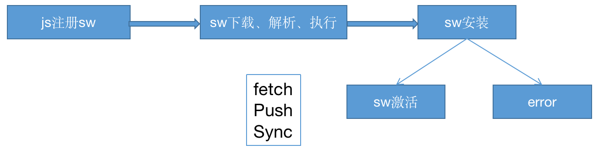

  图 6-1

  在注册 sw 前，需要检查浏览器是否支持。如果支持，就使用 register 函数注册。

  ```js
  // Registering Service Worker
  if ('serviceWorker' in navigator) {
    navigator.serviceWorker.register('./sw.js')
  }
  ```

  当调用 register 函数时，会通知浏览器下载 sw 文件并解析、运行 sw。如果注册失败，则该函数返回的 Promise 会执行 reject 方法。

  ```js
  navigator.serviceWorker
    .register('./sw.js')
    .then((reg) => console.log('SW registered!', reg))
    .catch((err) => console.log('Sorry,error occured', err))
  ```

  只要 sw 注册成功，install 事件就会被激活。

  ```js
  self.addEventListener('install', function (e) {
    //具体逻辑
  })
  ```

  安装完成后，sw 会被激活，并开始控制范围内的所有页面。注意，第一次注册 sw 时是不会控制页面的，直到它被再次加载。一旦 sw 再次生效，它会处于两种状态之一：一种是终止 sw，以节省内存；另一种是发起请求，并处理请求获取和消息事件，如图 6-2 所示。

  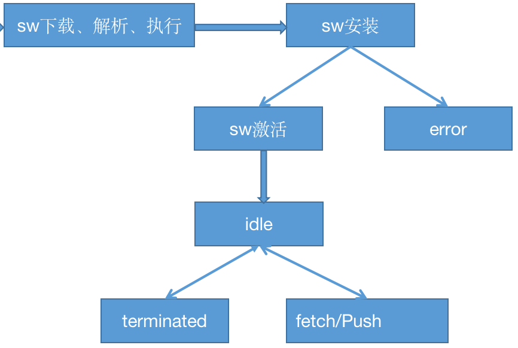

  图 6-2

  前面我们介绍了 sw 的安装过程，那么 sw 是如何更新的呢？

  （1）更新 sw 的 JavaScript 文件。 用户浏览系统时，浏览器会尝试在后台重新下载 sw 的脚本文件并进行对比，只要服务器上的文件和本地文件不同，这个文件就被认为是新的。

  （2）更新 sw 脚本文件，启动并触发 install 事件。这时，在当前系统上生效的依然是老版本的 sw，新版本的 sw 处于“waiting”状态。

  （3）在页面关闭之后，老版本的 sw 会被清掉，新版本的 sw 将接管页面。一旦新的 sw 生效，就会触发 activate 事件。

  接下来我们通过一个天气预报的例子系统梳理一个简单的 PWA 应用的开发过程。在开始之前，需要准备三样东西。

  （1）UI 外壳 。用户界面所需要的最小化的 HTML、CSS 和 JavaScript 文件，详细的请参考源代码部分。AJAX 请求为了简单起见，借用下 fetch 库。

  （2）城市代码。中国气象局提供了一组 API，可查询各城市、自治区、直辖市的代码。具体方法是，首先使用http://www.weather.com.cn/data/city3jdata/china.html ,查询省会的代码，然后根据某一省会代码，比如陕西省省会的的代码是 10111，调用接口http://www.weather.com.cn/data/city3jdata/provshi/10111.html, 获取城市列表。以西安为例，西安市的城市代码为 1011101（省会代码+城市代码）。如果想进一步获取西安下属各区的代码，则可以调用接口http://www.weather.com.cn/data/city3jdata/station/1011101.html, 最终的城市代码由西安市代码和某区代码联合组成。

  （3）天气接口。这里使用易客云提供的免费的天气 API 接口，前提是需要注册一个账号。登录控制台获取 APPID 和 APPSecret，这两项配置需要在查询天气的 URL 中指定。

现在我们先看下要实现一个什么样的功能，该页面的功能比较简单，在选择框中选择相应的城市，通过易客云提供的 API 查询所选城市近 7 天的天气情况，单击“发送通知”按钮发送通知，界面如图 6-3 所示。

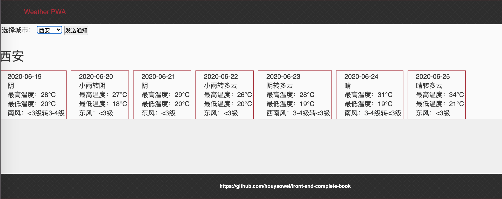

图 6-3

首先通过中国气象局提供的 API，查询几个城市的城市代码，如西安 （101110101）、上海（101020100）、杭州（101210101）等，构造下拉框。

```html
<section>
  <label>请选择城市：</label>
  <select id="city">
    <option value="101110101">西安</option>
    <option value="101020100">上海</option>
    <option value="101210101">杭州</option>
  </select>
  <button id="notifications">发送通知</button>
</section>
```

工程的目录结构如图 6-4 所示。

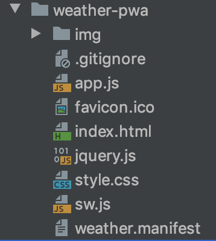

图 6-4

在项目开始之前，我们需要配置一下 manifest 文件、.js 入口文件和.html 文件。首先，创建 weather.manifest 文件并输入以下内容。注意，这里对文件名并无要求，也就是说，可以不以 manifest 为结尾。

```json
{
  "name": "weather PWA",
  "short_name": "weather",
  "description": "show some places weather",
  "icons": [
    {
      "src": "./favicon.ico",
      "sizes": "16x16",
      "type": "image/png"
    }
  ],
  "start_url": "./index.html",
  "display": "fullscreen",
  "theme_color": "#B12A34",
  "background_color": "#B12A34"
}
```

其次，在 index.html 的 header 中加入如下内容，使 manifest 文件生效。

```js
<link rel="manifest" href="./weather.manifest" />
```

在该例中，业务部分的入口文件是 app.js，主要用来实现业务逻辑、注册 sw 和发送通知等。

项目启动后自动注册 sw。

```js
// Registering Service Worker
if ('serviceWorker' in navigator) {
  navigator.serviceWorker.register('./sw.js').then((res) => {
    console.log('Registration succeeded. Scope is ' + res.scope)
  })
}
```

这里面需要特别注意 sw 文件的路径问题。在这个例子中，sw 文件被放在这个域的根目录下，这意味着 Service Worker 是与网站同源的。也就是说，这个 Service Worker 只会拦截这个域下的所有 fetch 事件。比如，Service Worker 文件被注册到/example/sw.js，那么 Service Worker 只能收到 /example/ 路径下的 fetch 事件，这时就需要在注册 sw 文件时指定 scope 属性。

```js
navigator.serviceWorker.register('/example/sw.js', { scope: '/example/' })
```

在 sw 中，指定文件缓存版本号和需要缓存的文件。

```js
var cacheName = 'weather-pwa-v1'
var appShellFiles = [
  './index.html',
  './app.js',
  './style.css',
  './jquery.js',
  './favicon.ico',
  './img/bg.png',
]
```

sw 文件被注册后，会执行绑定的 install 事件。install 事件一般被用来填充你的浏览器的离线缓存能力。为了实现缓存能力，我们使用 sw 文件的新的标志性的全局 Cache API。 主要有三个 API：

open: 打开一个 Cache 对象。

match: 返回一个 promise 对象，resolve 的结果是与 cache 对象中匹配的第一个已经缓存的请求。

addAll: 把指定的文件添加到指定的 cache 对象。

put：同时抓取一个请求及其响应，并将其添加到给定的 cache。

> Cache API： https://developer.mozilla.org/zh-CN/docs/Web/API/Cache

```js
// Installing Service Worker
self.addEventListener('install', function (e) {
  e.waitUntil(
    caches.open(cacheName).then(function (cache) {
      console.log('[Service Worker] Caching all: app shell and content')
      return cache.addAll(appShellFiles)
    })
  )
})
```

事件上接了一个 ExtendableEvent.waitUntil()方法，这样做的目的是确保 sw 文件不会在 waitUntil()里面的代码执行完毕之前完成安装。

```js
self.addEventListener('fetch', function (e) {
  e.respondWith(
    caches.match(e.request).then(function (r) {
      console.log('[Service Worker] Fetching resource: ' + e.request.url)
      return (
        r ||
        fetch(e.request).then(function (response) {
          return caches.open(cacheName).then(function (cache) {
            console.log(
              '[Service Worker] Caching new resource: ' + e.request.url
            )
            cache.put(e.request, response.clone())
            return response
          })
        })
      )
    })
  )
})
```

在 fetch 的事件监听器中，先匹配每个请求。如果在 cache 对象中能匹配到已经缓存的请求，就返回已缓存的内容，否则重新发起请求，并将缓存的结果继续放入 cache。

至此，PWA 核心部分已经配置完成，现在开始用 select 框选择地区并查询天气信息。

```js
document.getElementById('city').addEventListener('change', (e) => {
  //天气API
  let url = `https://www.tianqiapi.com/free/weekappid=68134783&appsecret=PblyiX1y&cityid=${e.target.value}`
  fetch(url)
    .then((res) => {
      return res.json()
    })
    .then((res) => {
      currentPlace = res
      document.getElementsByClassName('weather')[0].innerHTML = buildCard(
        res.data
      )
    })
})
```

初始化加载页面资源的情况如图 6-5 所示。

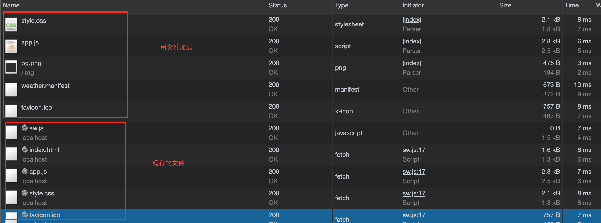

图 6-5

从资源加载情况来看，文件是从站点加载并进行缓存的。现在刷新页面或者断掉网络进行测试，如图 6-6 所示。

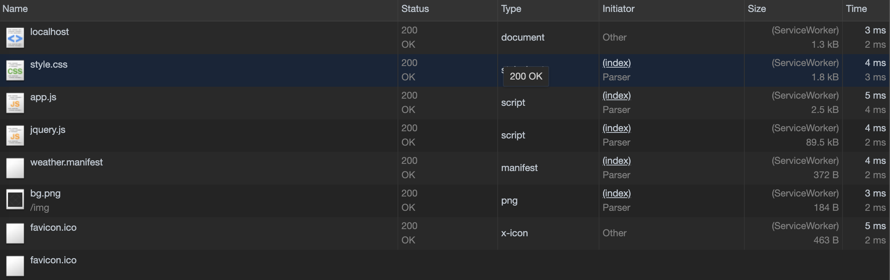

图 6-6

从 Size 列可以看出，这些文件都来自 ServiceWorker 缓存。在 select 框中选择“杭州”，看一下数据请求的情况，如图 6-7 所示。

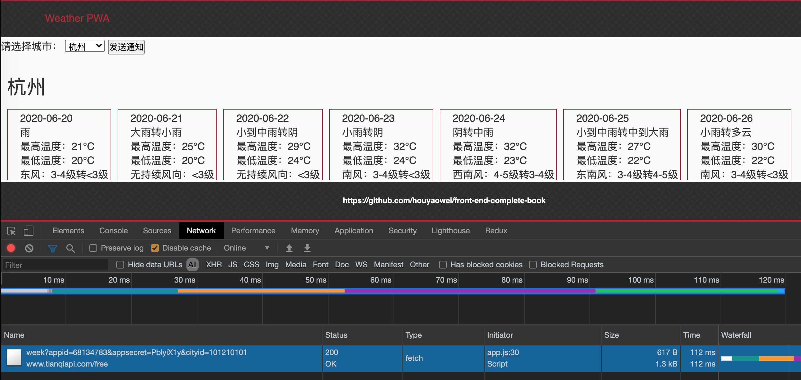

图 6-7

数据来自网络，并且数据能够正常返回和展示。下面继续刷新页面或者断掉网络进行测试，如图 6-8 所示。

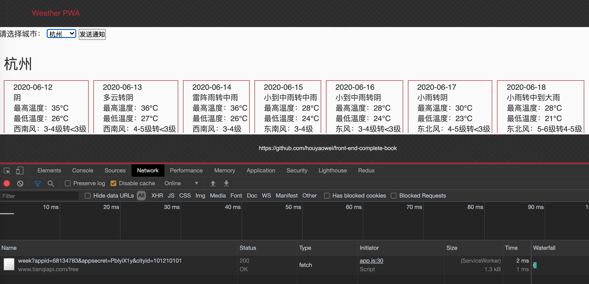

图 6-8

从上图中可以看出，数据来自 sw 文件，并且能够正确返回。

## 6.2 基于 single-spa 的微前端实践

single-spa 是由 JavaScript 实现的微前端框架。这个概念是由 ToughtWorks 于 2016 年提出的，微前端和后端的微服务相对，将后端微服务的理念应用于浏览器端，即 Web 应用由单一的单体应用转变为由多个小型前端应用聚合在一起的应用。各个前端应用可以独立运行、独立开发、独立部署，从而不影响其他模块的开发和部署。 独立部署的能力为构建孤立、松散耦合的服务提供了可能。

在前端的圈子里，各种轮子在不停的飞，美团的 Bifrost， 阿里的 icestark、qiankun，以及针对 angular 应用的 Mooa,最后就是大名鼎鼎的 single-spa。不过很多实践都是基于 single-spa 进行封装，包括在很多前端社区中能够看到的实现很多也都是基于 single-spa 的实践，所以我们也以这个实现作为蓝本实现微前端应用的基本骨架。

在介绍 single-spa 前，先介绍下微前端的实现方式有几种：

1.iframe 方式

iframe 实现可以让子应用独立开发、部署，然后方便地接入到主应用中，这个方案比较彻底并且用的也最多。但是很多问题去无法避免：页面加载变慢、内部蒙层无法完全覆盖外部页面、双向滚动条的问题、刷新后 iframe 回到首页的问题......

2.路由分发

路由分发式，即通过路由将不同的业务进行拆分，每个应用独立部署。通常可以通过 HTTP 服务器的反向代理来实现，又或者是应用框架自带的路由来解决。如图 6-9 所示。

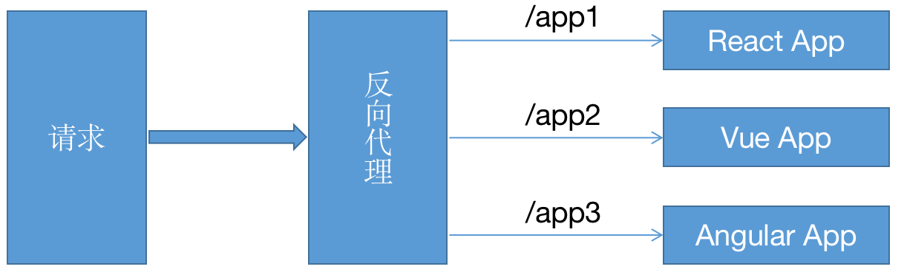

图 6-9

3.微件化

微件化（Widget）是一段可以直接嵌入应用上运行的代码，它由开发人员预先编译好 bundle 文件，在主应用启动时直接加载，不用做其他处理。微前端下的微件化是指每个业务线写自己的业务代码，并将编译好的 bundle 文件部署到指定的服务器上，运行时在特定模块加载相应的代码，如图 6-10 所示。

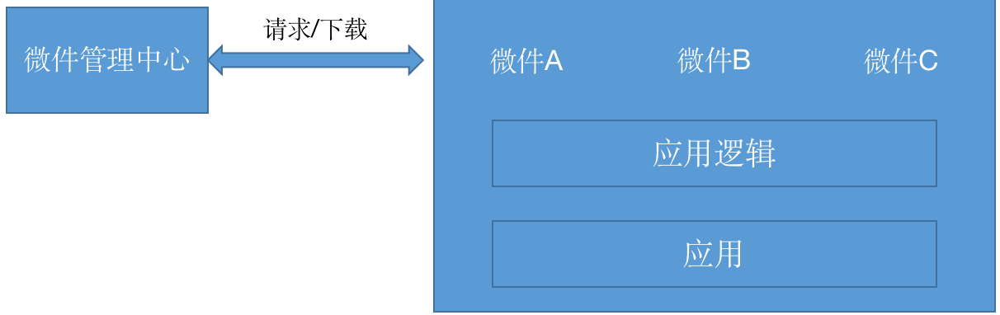

图 6-10

4.Web Components

Web Components 主要由以下四部分组成：

- Custom Ellements：开发者可以创建自定义元素。
- Shadow DOM：通常是将 Shadow DOM 附加到主文档 DOM 中，并控制其关联的功能。Shadow DOM 为 DOM 和 CSS 提供了封装，使得这些东西与主文档的 DOM 保持分离。
- HTML templates：即 `<template>` 和 `<slot>` 元素，用于编写不在页面中显示的标记模板。
- HTML Imports：用于引入自定义组件。

组件拥有自己独立的脚本和样式，以及对应的用于单独部署组件的域名。然而实现过程并不顺利，想要直接使用 Web Components 来构建前端应用还有很多困难需要面对：

- 重写现有应用的挑战，实现的工作量约等于重写应用的工作量。
- 生态系统不完善，对第三方组件的支持比较差。
- 系统架构复杂。当应用被拆分为多个组件时，组件间的通信就成了一个大麻烦。
- 不是所有浏览器都支持。例如，对已经习惯掉队的 IE 浏览器依然不支持，如果应用必须支持 IE 浏览器，则只能绕行了。

为了能够说清楚 single-spa 是如何实现微前端的，我们还需要了解以下几个前置条件：

- 高性能通用模块加载器 SystemJS：它可以在浏览器中使用各种通用规范，如 CommonJS、AMD、CMD、UMD 和 ESM 等。在 single-spa 中需要使用该加载器对各模块进行动态导入。

- single-spa: 微前端开发框架之一，它支持在少量改造现有应用的基础上提供微前端应用接入的能力。

- Import maps 规范： 该规范允许控制 js 的 import 语句或者 import()表达式导入库，并允许在非导入上下文中重用这个映射。

  ```js
  <script type="importmap">
  {
    "imports": {
      "moment": "****/moment/src/moment.js",
      "lodash": "****/lodash-es/lodash.js"
    }
  }
  </script>
  ```

  需要说明的是，这里配置第三方库的地址既可以是本地文件，也可以是 CDN 文件。通过上面的方式安装完 import map 后，就可以使用 import 方式导入了。

  ```js
  import moment from 'moment'
  import _ from 'lodash'
  ```

  有时候，可能有这样的场景，在模块中可能需要使用某个库的不同版本。在这种情况下，有两种解决办法：（1）在 imports 中声明两个 key 值，（2）在 import maps 中加入 scopes 配置。

  ```js
  {
    "imports": {
      "querystringify": "/node_modules/querystringify/index.js"
    },
    "scopes": {
      "/node_modules/socksjs-client/": {
        "querystringify": "/node_modules/socksjs-client/querystringify/index.js"
      }
    }
  }
  ```

  `querystringify`映射到`/node_modules/querystringify/index.js`，并且 `/node_modules/socksjs-client/querystringify`映射到`/node_modules/socksjs-client/querystringify/index.js`。从扩展性上看，在 scopes 上添加配置的方式更加灵活，语义性也更好，因此推荐使用这种方式。

  有了上面的基础，是时候揭开 single-spa 的面纱了。在该实践中会接入 React 项目、Vue 项目、AngularJS 项目和 Angular 项目。需要说明的是，为了项目的快速集成，每个子项目只提供最基础的功能，并且所有子项目和 Portal 都在同一个工程中，在后续的代码更新中会逐渐完善部署部分、样式隔离部分等内容。

  项目的代码结构如下图所示，React、Vue、Angularjs 和 Angular 项目分别对应 app1,app2,app3 和 app4。有一个 baseDep 需要说明一下，在前端开发中，我们不总是希望把三方的核心开发包打入到 bundle 文件中，所以就提供一个公共的工程，在工程启动的时候把三方包写入到 Portal 的 systemjs-importmap 中，如图 6-11 所示。

  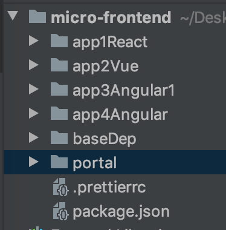

  图 6-11

  在 baseDep 工程的根目录下新建一个 base.js， 先定义需要写入的第三方包，为了区分开发环境和生产环境，需要分别进行定义。

  ```js
  const devLibs = {
    imports: {
      react: '/libs/frameworks/react/react.development.js',
      vue: 'https://www.unpkg.com/vue@2.6.10/dist/vue.js',
      'react-dom': '/libs/frameworks/react/react-dom.development.js',
      'single-spa': '/libs/systemjs/single-spa.js',
    },
  }
  const prodLibs = {
    imports: {
      react: '/dist/libs/framework/react/react.production.min.js',
      'react-dom': '/dist/libs/framework/react/react-dom.production.min.js',
      'single-spa': '/dist/libs/single-spa.min.js',
    },
  }
  ```

  定义第三方包后，还需要定义一个方法，它需要有这么一种能力，工程启动动态创建 script 标签，并把上面的配置写入 portal，比如方法名叫作 insertNewImportMap ，参数即为上面定义的配置对象。

  ```js
  function insertNewImportMap(mapJson) {
    const scriptObj = document.createElement('script')
    scriptObj.type = 'systemjs-importmap'
    scriptObj.innerHTML = JSON.stringify(mapJson)

    const allImportMaps = document.querySelectorAll(
      'script[type="systemjs-importmap"]'
    )
    allImportMaps[allImportMaps.length - 1].insertAdjacentElement(
      'afterEnd',
      scriptObj
    )
  }
  ```

  接下来就可以写 portal 部分了，我们先实现一个简单的菜单，点击菜单加载应用，在 Portal 中，暂时没有提供框架支持，仍需使用 history 的 pushState 方法进行路由切换。

  > single-spa 官网提供了一个名为 navigateToUrl 的方法可以进行路由切换，通过对它的源码进行分析可知，该方法是在 history 的基础上进行封装的。

  页面导航部分如图 6-12 所示。

  

  图 6-12

  对应的 HTML 代码如图 6-13 所示。

  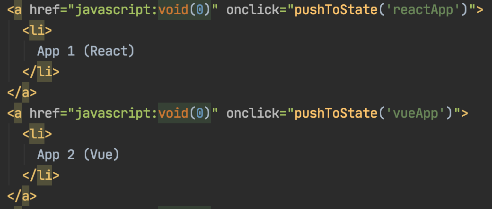

  图 6-13

  下面实现一个 js 跳转的方法，该参数值的作用是在注册子应用时，提供一个检测是否激活某个子应用的方法。如果检测方法返回 true，则 single-spa 会激活该应用并挂载到相应的节点，如果检测方法返回 false，则会 unmount 解除这个应用。我们在后文注册子应用时实现这个方法。

  ```js
  function pushToState(target) {
    window.history.pushState({}, 'title', target)
  }
  ```

  前文曾介绍过，前端的模块开发需要遵循几个规范，最常见的有 AMD、CMD、UMD 和 CommonJS，也更加通用。我们现在想一个问题，有了遵循这些规范开发的模块，我们应该已某种方式加载这种规范的实现。在本书的 4.4 节中详细地介绍了这 4 种规范的具体实现，如果有需要可以移步到那里。

  在微前端的开发中，官方提供了一个叫作 SystemJS 的通用模块加载器，可以运行在服务端和浏览器端。有了这个工具就可以注册子应用了，single-spa 官网提供了一个名为 registerApplication 的 API 可用来注册子应用。

  先注册 4 个应用，并提供活动监测函数，函数实现如下所示。

  ```js
  export function prefix(location, ...prefixes) {
    return prefixes.some(
      (prefix) => location.href.indexOf(`${location.origin}/${prefix}`) !== -1
    )
  }
  export function app1React(location) {
    return prefix(location, 'reactApp')
  }
  export function app2Vue(location) {
    return prefix(location, 'vueApp')
  }
  export function n1App(location) {
    return prefix(location, 'a1App')
  }
  export function n7App(location) {
    return prefix(location, 'a7App')
  }
  ```

  注册应用代码。

  ```js
  import * as isActive from './activityFns'
  singleSpa.registerApplication(
    'reactApp',
    () => SystemJS.import('@portal/reactApp'),
    isActive.app1React
  )
  singleSpa.registerApplication(
    'vueApp',
    () => SystemJS.import('@portal/vueApp'),
    isActive.app2Vue
  )
  singleSpa.registerApplication(
    'a1App',
    () => SystemJS.import('@portal/a1App'),
    isActive.n1App
  )
  singleSpa.registerApplication(
    'a7App',
    () => SystemJS.import('@portal/a7App'),
    isActive.n7App
  )
  ```

  调用该 API 注册后，single-spa 会在数组中暂存这些应用，如下面的源码所示，并把应用状态设置成 NOT_LOADED。

  ```js
  apps.push({
    loadErrorTime: null,
    name: appName,
    loadImpl,
    activeWhen: activityFn,
    status: NOT_LOADED,
    parcels: {},
    devtools: {
      overlays: {
        options: {},
        selectors: [],
      },
    },
    customProps,
  })
  ```

  接下来调用 start 方法启动应用，并根据当前 URL 判断要加载哪些应用。activeWhen 保存的是之前定义的应用活动监测函数。

  ```js
  //app.helper.js
  export function shouldBeActive(app) {
    try {
      //app表示每个已经注册的应用
      return app.activeWhen(window.location)
    } catch (err) {
      handleAppError(err, app)
      app.status = SKIP_BECAUSE_BROKEN
    }
  }
  ```

  试想，当我们切换应用时，single-spa 是以什么样的方式切换的呢？首先，single-spa 在路由层做了一层拦截，使用注册全局监听的方式。

  > 当然也可以通过 window.onhashchange= function(){}的方式订阅。

  ```js
  //navigation-events.js
  window.addEventListener('hashchange', urlReroute)
  window.addEventListener('popstate', urlReroute)
  ```

  hashchange 事件监听的是 URL 中锚点的变化，该变化会导致历史记录栈也发生变化。常见的改变网页锚点变化的方式有以下几种：

  - 直接改变浏览器的地址，在后面拼接或者改变 #hash 值。

  - 通过 API 修改 location.href 或 location.hash 的值。

  - 单击带有锚点的链接。

  - 单击浏览器的前进或后退按钮。

    对于 pushState，与该 API 相关的主要有 replaceState API 和 onpopstate 事件。pushState 是在浏览器的历史记录栈中压入一条新的记录，然后把当前指针就移到这条新的条目上并且激活它，然后改变浏览器的地址。replaceState 的用法和 pushState 一致，只不过它不会在历史记录栈中增加新的条目。onpopstate 事件的触发比较有特定：

  - 有 history.pushState 或者 history.replaceState 的时候不会触发该事件。

  - 在 history.go、history.back、history.forward 调用的时候会触发该事件。

  - 有 hashchange 的时候会触发该事件。

  > 注意：在 Firefox 和 Chrome 中首次打开页面时不会触发 popstate 事件，但是在 Safari 中首次打开页面时会触发 popstate 事件。

```js
function urlReroute() {
  reroute([], arguments)
}
```

reroute 方法是 single-spa 的核心，这个方法主要有两个作用：（1）如果应用已经启动，就优化需要处理 unload、unmount 的应用；（2）如果应用未启动，就加载应用。如图 6-14 所示。

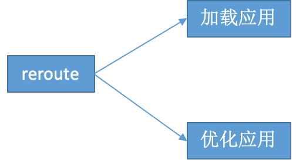

图 6-14

```js
// src/navigation/reroute.js
if (isStarted()) {
  appChangeUnderway = true
  appsThatChanged = appsToUnload.concat(appsToLoad, appsToUnmount, appsToMount)
  return performAppChanges()
} else {
  appsThatChanged = appsToLoad
  return loadApps()
}
```

在注册过子应用之后，可以使用 singleSpa.start()启动应用。

```js
export function start(opts) {
  ...
  if (isInBrowser) {
    reroute();
  }
}
```

1. 子应用加载探究

前文提过，single-spa 是通过 SystemJS 加载器加载子应用代码的。在内部，single-spa 提供约定声明周期的方法对子应用进行管理。为了方便理解，我们先以 React 项目为例，看如何把一个普通的 SPA 应用改造成一个 single-spa 的子应用。

为了能加载 React 子应用，需要引入 React 的适配包——single-spa-react。适配包的主要作用是适配通用的声明周期钩子函数，保证应用可以正确地运行。

先看 Webpack 配置，在 entry 配置中把声明周期函数所在地文件作为入口，如图 6-15 所示。

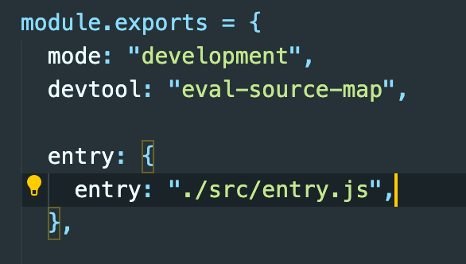

图 6-15

entry.js

```js
import React from 'react'
import ReactDOM from 'react-dom'
import singleSpaReact from 'single-spa-react'
import Root from './root.component.js'

const reactLifecycles = singleSpaReact({
  React,
  ReactDOM,
  rootComponent: Root,
  domElementGetter,
})

export const bootstrap = [reactLifecycles.bootstrap]

export const mount = [reactLifecycles.mount]

export const unmount = [reactLifecycles.unmount]

function domElementGetter() {
  // 声明div元素用来挂载子应用
  let el = document.getElementById('app1')
  if (!el) {
    el = document.createElement('div')
    el.id = 'app1'
    document.body.appendChild(el)
  }
  return el
}
```

在 singleSpaReact 的构造函数中，需要传入 React 的核心库、React-dom、rootComponent 和挂载节点的 Getter 函数。

在 domElementGetter 方法中，需把指定的 React 应用挂载到子节点，实例化后会立即把页面挂载到该 DOM 节点上，如图 6-16 所示。

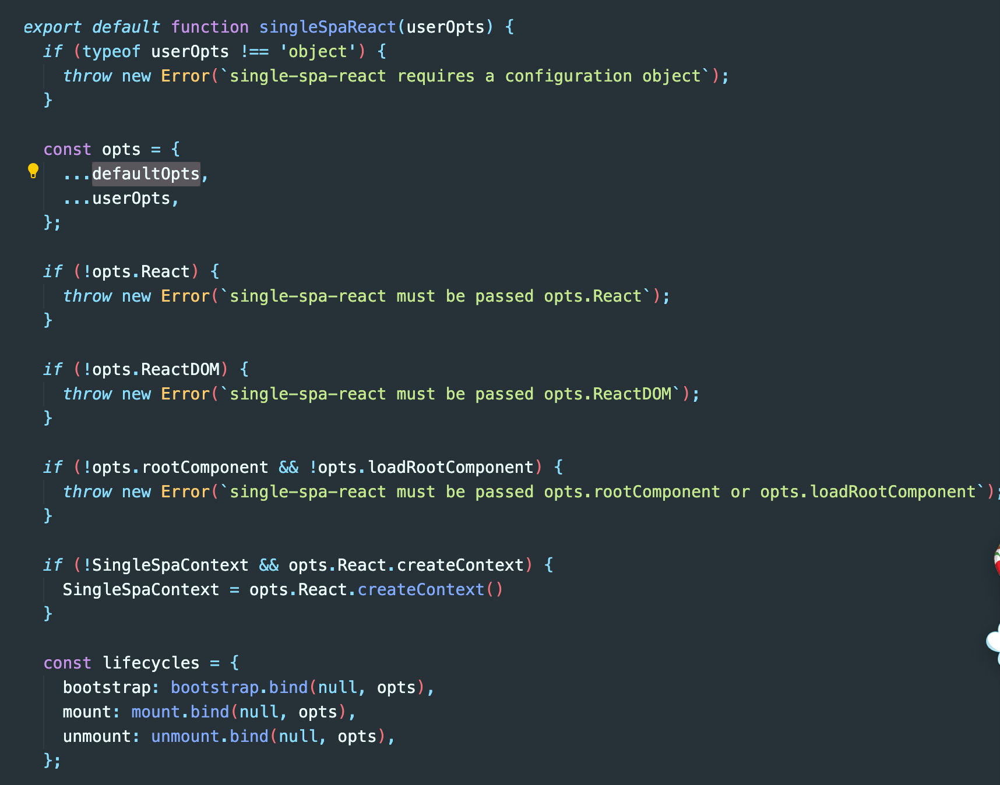

图 6-16

SystemJS 是支持多种模块规范的代码加载器，可以支持 AMD、CMD、CommonJS、ES6 等规范，如图 6-17 所示。在 HTML 文件中我们引入了 amd.js、 named-exports.js 和 use-default.js。

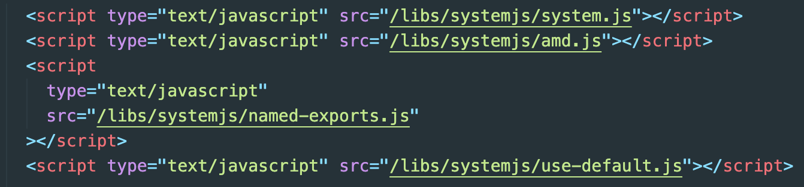

图 6-17

这些库可以完成的功能如下：

- amd.js：支持 AMD 规范实现的模块加载。
- named-exports：对 AMD 模块、全局导入的扩展支持模块按需引入。例如，import {format} from '../tools.js'，而不是 import T from '../tools.js';T.format()。
- use-default：直接返回 AMD 模块，而不是返回{default: amdModule}。

> 在 ES6 module 中有相应的 default 命令，可以把某个方法或者变量导出为默认的。
>
> 比如 ：
>
> export default function(){
>
> return "default function"
>
> }
>
> 引入的时候就可以使用 import func from "文件路径"
>
> func(). //返回 "default function"

通过上面的配置不难发现，各个子应用都与 AMD 规范相关。为了使 SystemJS 能够准确地加载子应用，我们应把各个应用打包（Webpack）成 AMD 规范的。

首先在 Webpack 的 output 中进行配置：

```js
libraryTarget: "amd",
```

libraryTarget 是指设置 library 的暴露方式，具体的值有 commonjs、commonjs2、umd、this 和 var 等。

- libraryTarget:"assign"。暴露一个未定义的 library 设置的变量。在 node 环境下不支持。

- libraryTarget:"var"。暴露一个用 var 定义的 library 设置的变量。在 node 环境下不支持。

- libraryTarget:"window"。在 window 对象上定一个 library 设置的变量。在 node 环境下不支持。

- libraryTarget:"global"。在 global 对象上定义一个 library 设置的变量。受 target 属性影响，当 target 为默认值 Web 时，会在 window 对象上注册。如果想在 global 对象上注册，则必须修改 target 为 node。

- libraryTarget:"this"。在当前的 this 对象上定义一个 library 设置的变量，如果 this 对象是 window 对象，就在 window 对象。在 node 环境中，如果未指定 require 赋值的变量，则不会指向 global 对象。

- libraryTarget:"commonjs"。在 export 对象上定义 library 设置的变量。在 node 环境下支持，在浏览器中不支持。

- libraryTarget:"commonjs2"。直接用 module.export 导出 export 对象，会忽略 library 设置的变量。在 node 环境下支持，在浏览器中不支持。

- libraryTarget:"amd"。在 define 方法上定义 library 设置的变量，不能用 script 直接引用，必须通过第三方模块来使用。

2. 注意事项

（1）SystemJS 不应该被转译：在 single-spa 实现的微前端应用中，SystemJS 扮演了一个加载器的角色，不应该被其他编译工具干扰，所以在 Webpack 配置 js 文件加载时需要排除该文件， 在 rules 中增加如下配置：

```js
{
  parser: {
  System: false,
  },
 }
```

（2）去掉 Webpack 中的 splitChunks 配置，这项配置在第 5 章中做过相关的介绍，这里再简单介绍一下，有些库包比较大，如果一起打包会导致文件过大，所以应该利用浏览器的并发数，把大文件拆开。

```js
splitChunks: {
  chunks: "all",
  maxAsyncRequests: 5,
  maxInitialRequests: 3,
  cacheGroups: {
    vendor: {
      chunks: "all",
      test: path.resolve(__dirname, "../node_modules"),
      name: "duplication-[hash:5]",
      enforce: true
    }
  }
}
```

在上面的配置中，我们把 node_modules 中配置最大加载次数为 5 的都强制打包到 duplication-[hash:5].js 中 ，以减少主 js 文件的大小。

如果不去掉这项配置，则 single-spa 是无法正确加载 React 应用的源文件的。

3. 配置 Vue 项目

在日常 Web 开发中，Vue 及其全家桶的应用范围越来越大，在 PC 端和 App 端都有很好的选择。现在 Vue 3.0 已进入 RC 阶段，相信不久就会出 GA 版。回到主题，single-spa 接入 Vue 应用无论如何也是一个绕不开的话题。

在接入 React 的项目时，我们详细介绍了各个部分，所以在本节中接入 Vue 应用会轻松很多。主要还是有几方面的修改：

（1）添加工程的入口文件，引入 single-spa 和 Vue 的连接库：

```js
yarn add single-spa-vue
```

并进行实例化，然后添加 mount 和 unmout 的声明周期方法。

```js
import singleSpaVue from 'single-spa-vue'
import App from './App.vue'

Vue.config.productionTip = false
const vueLifecycles = singleSpaVue({
  Vue,
  appOptions: {
    el: '#app4',
    render: (h) => h(App),
  },
})
export const bootstrap = [vueLifecycles.bootstrap]
export function mount(props) {
  createDomElement()
  //window.store = props.globalEventDistributor;
  //window.globalEventDistributor = props.globalEventDistributor;
  return vueLifecycles.mount(props)
}

export const unmount = [vueLifecycles.unmount]
function createDomElement() {
  // Make sure there is a div for us to render into
  let el = document.getElementById('app4')
  if (!el) {
    el = document.createElement('div')
    el.id = 'app4'
    document.body.appendChild(el)
  }
  return el
}
```

（2）在 Webpack 配置（非 vue-cli 生成的工程）的 module/rules 中增加如下配置。

```js
{
  parser: {
    System: false
  }
}
```

如果是 vue-cli 生成的工程，则需要在 vue.config.js 的 chainWebPack 中进行配置。

（3）在 external 中配置不打入 bundle 包中的第三方库，前提是在公共应用中已经把该三方库写入 import-maps 中。

### 6.3 在 Docker 中部署前端应用

Docker 是 dotCloud 开源的一个基于 LXC 虚拟化技术的应用容器引擎，可以轻便灵活地隔离环境，进行扩容和运维管理。

> LXC，全称 Linux Container 容器是一种内核虚拟化技术，提供轻量级的虚拟化隔离进程和资源。

Docker 在容器的基础上，进行了进一步的封装，从文件系统、网络连接到进程隔离等，极大地简化了容器的创建和维护，使得 Docker 技术比虚拟机技术更为轻便、快捷。传统虚拟机技术是虚拟出一套硬件后，在其上运行一个完整的操作系统，在该系统上再运行所需的应用进程，而容器内的应用进程是直接运行于宿主内核中的，因为容器没有自己的内核，从这个角度看，容器更加轻量。

现在 Docker 的应用越来越多，应用范围也从运维、后端慢慢向前端扩展。到底 Docker 有哪些优质特性做到如此广泛的应用呢，仔细总结一下可能有如下几条：

- 新的虚拟化实现，比传统虚拟机更轻量级。

- 资源利用更高效，因为 Docker 是直接运行在宿主机上，所以不需要进行硬件抽象。

- 多环境配置一致，Docker 的一个关键优势就是提供统一的环境配置，把应用的环境打成镜像的形式向外提供服务，而不用考虑各个环境的差异。

- 持续交付和部署的能力，使用 Docker 可以通过定制应用镜像来实现持续集成、持续交付、部署。开发人员可以通过 Dockerfile 来进行镜像构建，并结合持续集成(CI) 系统进行集成测试，而运维人员则可以直接在生产环境中快速部署该镜像，甚至结合持续部署(CD) 进行自动部署。

- 迁移更简单，该项特性得益于 Docker 的环境隔离机制。

现在前后端都在强调 devops 的理念，所以前后端的项目部署都趋向于自动化。接下来我们通过一个简单的案例介绍如何借助 Docker 实现前端的项目部署。

在介绍自动化部署之前，先简单回顾一下是以前是如何进行刀耕火种般部署的：

首先，使用 `yarn install` 或者`npm install` 安装依赖。

其次，使用`npm/yarn run build`编译、打包生成静态文件。

最后，把静态文件拷贝到服务器相应的目录下，并配置 Nginx，如文件路径、端口、跨域请求等。

这个流程是不是特别的复杂？

既然要和 Docker 打交道，那么自然少不了要和 Docker 命令和 Dockerfile 打交道，为了提高操作的完整性，这里有必要介绍一下 Docker 的基本操作和 Dockerfile 的相关知识。

Docker 为主流操作系统（Linux、macOS 和 Windows）提供了安装包，请根据自己的操作系统自行下载。

1.Docker 架构

Docker 使用 C/S 架构，Client 通过接口与 Server 进程通信，实现容器的构建、运行和发布。Client 和 Server 既可以运行在同一台集群，也可以跨主机实现远程通信，如图 6-18 所示。

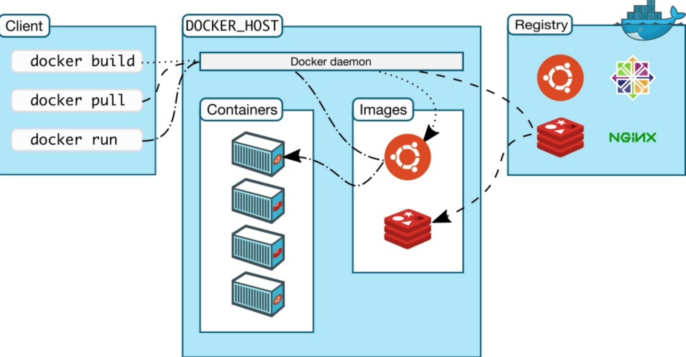

图 6-18

2.Dorcker 的核心概念

镜像、容器与仓库是 Docker 中最基本、最核心的概念。掌握与理解这三个概念是学习 Docker 的关键。

（1）镜像。

镜像（Image）就是一个含有文件系统的面向 Docker 引擎的只读模板。任何应用程序运行都需要环境，而镜像就是用来提供这种运行环境的。镜像可以用来创建 Docker 容器，一个镜像可以创建很多容器。Docker 提供了一个很简单的机制来创建镜像或者更新现有的镜像，用户甚至可以直接从其他人那里下载一个已经做好的镜像来直接使用。

（2）容器。

Docker 利用容器（Container）独立运行一个或一组应用。容器是从镜像创建的运行实例，它可以被启动、开始、停止和删除。每个容器都是相互隔离的、可保证安全的平台。可以把容器看作一个简易版的 Linux 环境（包括 root 用户权限、进程空间、用户空间和网络空间等）和运行在其中的应用程序。

容器的定义和镜像几乎一模一样，也是一堆层的统一视角，唯一区别在于容器的最上面那一层是可读可写的。

（3）仓库。

仓库（Repository）是集中存放镜像文件的场所。有时候会把仓库和仓库注册服务器（Registry）混为一谈，并不严格区分。实际上，仓库注册服务器上往往存放着多个仓库，每个仓库中又包含了多个镜像，每个镜像有不同的标签（tag）。

仓库分为公开仓库（Public）和私有仓库（Private）两种形式。最大的公开仓库是 Docker Hub，存放了数量庞大的镜像供用户下载。国内的公开仓库包括阿里云、网易云、腾讯云、时速云、daoCloud 等，可以供用户更稳定快速地访问。当然，用户也可以在本地创建一个私有仓库。

用户在创建了自己的镜像之后，就可以使用 push 命令将它上传到公有仓库或者私有仓库，当在另一台机器上使用这个镜像时，只需要使用 pull 命令从仓库上拉取下来就可以了。

3.Docker 中关于镜像的基本操作

现在默认已经安装了 Docker 引擎，可以使用命令看一下具体的版本号：

```
~ docker -v
Docker version 19.03.8, build afacb8b
```

如果能正常显示版本号，则证明已正确安装了 Docker。

先用 docker images 命令查看一下在本地镜像仓库中有哪些镜像（如果是新安装的引擎，则本地镜像为空）：

```js
~ docker images
REPOSITORY   TAG    IMAGE ID   CREATED  SIZE
```

前面介绍过，镜像文件都存放在镜像仓库中。如果想直接使用现成的镜像文件，则可以使用 pull 命令从 hub 中拉取。注意，可以在官方的镜像仓库中查找是否有现成的镜像文件，当然也可以通过 docker 命令实现，后面会介绍。这就像在前端开发中，为了实现某一个功能在 npm 仓库中查找三方包一样。

装 npm 包可以使用 npm install xxx 或者 yarn add xxx，那么应如何拉取镜像呢？Docker 中提供的 pull 命令可以达到这个目的。

在 Docker hub 中有一个 hello-world 镜像，可以帮助我们快速上手，如图 6-19 所示。

  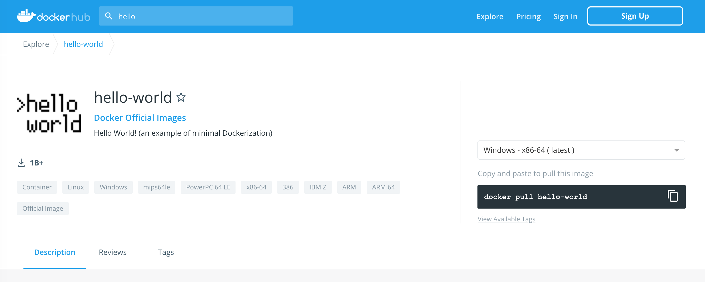

图 6-19

```js
~ docker pull hello-world
Using default tag: latest
latest: Pulling from library/hello-world
0e03bdcc26d7: Pull complete
Digest: sha256:4cf9c47f86df71d48364001ede3a4fcd85ae80ce02ebad74156906caff5378bc
Status: Downloaded newer image for hello-world:latest
docker.io/library/hello-world:latest
```

拉取一个或多个镜像可使用 docker pull 命令，如果没有指定镜像标签，则 Docker 默认使用:latest，上面的示例命令就会拉取最新的镜像文件，等同于 docker pull hello-world:latest。Docker 使用内存寻址方式来存储镜像文件，镜像文件 ID 是通过 SHA256 摘要方式包含其配置和镜像层的。

接下来通过 docker images 命令查看本地已存在的镜像文件：

```js
~ docker images
REPOSITORY    TAG         IMAGE ID       CREATED         SIZE
hello-world   latest      bf756fb1ae65   8 months ago     13.3kB
```

列表中包含了仓库名、标签、镜像 ID、创建时间 及 所占用的空间。镜像 ID 是镜像的唯一标识，一个镜像可以对应多个标签，每个仓库可以包含多个标签，每个标签对应一个镜像。

运行一下，看看效果：

```js
~ docker run hello-world

Hello from Docker!
This message shows that your installation appears to be working correctly.

To generate this message, Docker took the following steps:
 1. The Docker client contacted the Docker daemon.
 2. The Docker daemon pulled the "hello-world" image from the Docker Hub.
    (amd64)
 3. The Docker daemon created a new container from that image which runs the
    executable that produces the output you are currently reading.
 4. The Docker daemon streamed that output to the Docker client, which sent it
    to your terminal.

To try something more ambitious, you can run an Ubuntu container with:
 $ docker run -it ubuntu bash

Share images, automate workflows, and more with a free Docker ID:
 https://hub.docker.com/

For more examples and ideas, visit:
 https://docs.docker.com/get-started/
```

从上面的提示信息可以看出，镜像文件已经正常工作了。如果想让启动的容器在后台应用，可以加上-d 参数。

到目前为止，我们都是通过镜像名称或者加标签的方式来拉取镜像文件，显然这是一种很方便的拉取镜像的方式。如果使用标签拉取，那么当你再次使用 docker pull 的时候可以确保拉取的是最新的镜像文件。例如，docker pull ubuntu:18.04 便可以拉取最新的 Ubuntu 18.04 镜像。

当拉取一个镜像时，需要指定 Docker Registry 的地址和端口号，默认是 Docker Hub，除此之外，还需要指定仓库名和标签。仓库名和标签可以唯一确定一个镜像，而标签是可能省略的，如果省略，则默认使用 latest 作为标签名。另外，仓库名由作者名和软件名组成。

```js
docker pull [选项] [Docker Registry 地址[:端口号]/]仓库名[:标签]
```

如果拉取非官方的第三方镜像，则需要指定完整仓库名，如下：

```js
docker pull mysql/mysql-server:latest
```

当不需要本地的某些镜像时，也可以删除该镜像，以节省存储空间。需要注意的是，如果使用该镜像创建的容器未删除，则不允许删除该镜像。

在 Docker 中有两个关于删除的命令：docker rm 和 docker rmi。docker rmi 命令可用于删除镜像，docker rm 命令可用于删除容器。

我们先试着删除一下 hello-world 镜像，看看效果是怎样的：

```js
~ docker image rm hello-world
Error response from daemon: conflict: unable to remove repository reference "hello-world" (must force)- container 20e8f92b12f5 is using its referenced image bf756fb1ae65
```

通过上面的提示可以看出，并未成功删除 hello-world 镜像，这是因为在启动 hello-world 镜像的时候，使用 docker run 命令基于 hello-world 镜像创建了一个全新的容器。因此需要先删除容器，再删除 hello-world 镜像。当然，docker rm 命令和 docker rmi 命令都提供了 -f 命令，可强制删除存在容器的镜像或启动中的容器，示例如下：

```js
 ~ docker rmi -f hello-world
Untagged: hello-world:latest
Untagged: hello-world@sha256:4cf9c47f86df71d48364001ede3a4fcd85ae80ce02ebad74156906caff5378bc
Deleted: sha256:bf756fb1ae65adf866bd8c456593cd24beb6a0a061dedf42b26a993176745f6b
```

在 Docker 中还有一个比较重要的命令就是 docker ps，该命令可以查看容器的相关信息，默认只显示正在运行的容器信息，可以查看的信息有 CONTAINER ID、NAMES、IMAGES、STATUS 和 PORTS 等，如图 6-20 所示。

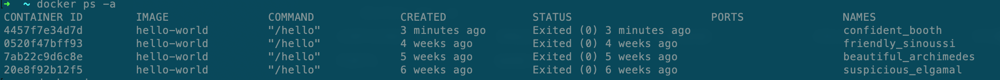

图 6-20

有了上面的命令基础之后，下面介绍一下 Docker 和前端是怎样融合的。

在构建镜像之前，需要先构造一个 Dockerfile 文件。Dockerfile 是一个用来构建镜像的文本文件，其中包含了一条条构建镜像所需的命令和说明。

先来看一个简单的 Dockerfile 文件描述：

```js
FROM node:12.19.0

# 代表生产环境
ENV PROJECT_ENV production

# 许多场景下会根据此环境变量使用不同的配置，特别是在Webpack中打包时，会根据此环境变量做出优化
ENV NODE_ENV production

WORKDIR /code
ADD . /code
RUN npm install -g http-server
RUN npm install && npm run build
EXPOSE 80

CMD http-server ./public -p 80
```

> 注意：Dockerfile 命令是不区分大小写的，但是为了方便和参数区分开，通常使用大写字母 。

下面解释一下每条命令都是用来做什么的，这样再写其他的 Dockerfile 文件更会更加得心应手。

From 命令表示该镜像是基于什么来构建的，换句话说，是基于 FROM 的镜像。在某些镜像文件中，你看到的可能是 From ubuntu 或者是 From centos 等，这两个就是基于 Ubuntu 和 CentOS 来构建镜像的。

Env 命令是用来设置环境变量的，在定义了环境变量之后，在后续的命令中，就可以使用了。设置格式如下：

```
ENV <key> <value>
ENV <key1>=<value1> <key2>=<value2>.
```

在上面中，我们设置了两个环境变量 ROJECT_ENV 和 NODE_ENV

WORKDIR 可用来指定工作目录。作用同 docker run -w 。用 WORKDIR 指定的工作目录，会在构建镜像的每一层中都存在。工作目录可以指多个，每个 WORKDIR 只影响它下面的命令，直到遇见下一个 WORKDIR 为止。需要注意的是，WORKDIR 指定的工作目录必须是提前创建好的。

ADD 命令，作用与 copy 命令，用法也一样。与 copy 命令不同的是，当执行 的<源文件> 为 tar 包时，压缩格式为 gzip、 bzip2 以及 xz 的情况下，会自动复制并解压缩到 <目标路径>。这就带来了一个弊端，在不解压缩的前提下，无法复制 tar 包中的 压缩文件。命令镜像构建缓存失效，从而可能使命令镜像构建变得比较缓慢。具体是否使用，可以根据是否需要自动解压缩来决定。

RUN 命令用于执行后面跟着的命令，如 RUN npm install -g http-server ，等同于在命令行全局安装 http-server。如果是多条命令，则可以使用&&连接，到现在你有没有发现和 shell 命令写法如出一辙呢？其实在以某个基础镜像构建新的镜像时，就不再使用以该基础镜像的命令行了。再看一个例子：

```
FROM centos
RUN yum install wget
RUN wget -O redis.tar.gz "http://download.redis.io/releases/redis-5.0.3.tar.gz"
RUN tar -xvf redis.tar.gz
```

上面的命令表示以 CentOS 为基础镜像，在 RUN 中可以使用 yum 命令来操作，就像在 Ubuntu 中使用 apt 命令一样。

EXPOSE 仅仅只用来声明端口，它有两个作用：

（1）帮助镜像使用者理解这个镜像服务的守护端口，以便配置映射。

（2）在运行时如果使用随机端口映射时，也就是 docker run -P 时，会自动随机映射 EXPOSE 的端口。

CMD 命令，类似于 RUN 命令，用于运行程序，但二者运行的时间点稍有不同。CMD 命令 在 docker run 时运行，RUN 命令是在 docker build 时执行。为启动的容器指定默认要运行的程序，当程序运行结束时，容器也结束。CMD 命令指定的程序可被 docker run 命令行参数中指定要运行的程序所覆盖。如果 Dockerfile 中存在多个 CMD 命令，仅最后一个生效。

**实例**

在了解了上面的命令之后，下面通过一个简单的实例构建一个简单的镜像，显示一个静态 HTML 文件并在页面显示“Docker is running”。为了演示效果，我们不引入后台服务，只通过前端服务器进行构建。

Dockerfile 的描述如下：

```
FROM node:12.19.0
ADD ./index.html /
RUN npm install -g http-server
EXPOSE 9001
CMD http-server -p 9001
```

该镜像构建在node@12.19.0的基础上，安装前端 HTTP 服务器 http-server（可以从 npm 官网安装），并暴露 9001 端口。

在 Dockerfile 的同级目录下建一个静态 html 文件。

```html
<!DOCTYPE html>
<html lang="en">
  <head>
    <meta charset="UTF-8" />
    <title>Docker test</title>
  </head>
  <body>
    <h3>Docker is running</h3>
  </body>
</html>
```

一切就绪，现在开始通过 Dockerfile 构建一个 test:v1。

```shell
$ docker build -t test:v1 .
```

> 注意：最后的 **\*\*.\*\*** 代表本次执行的上下文路径， 指的是 Docker 在构建镜像时，如果要使用本机的文件，则 docker build 命令在得到这个路径之后，会在路径下查找文件并打包。

打包的过程如图 6-21 所示。

  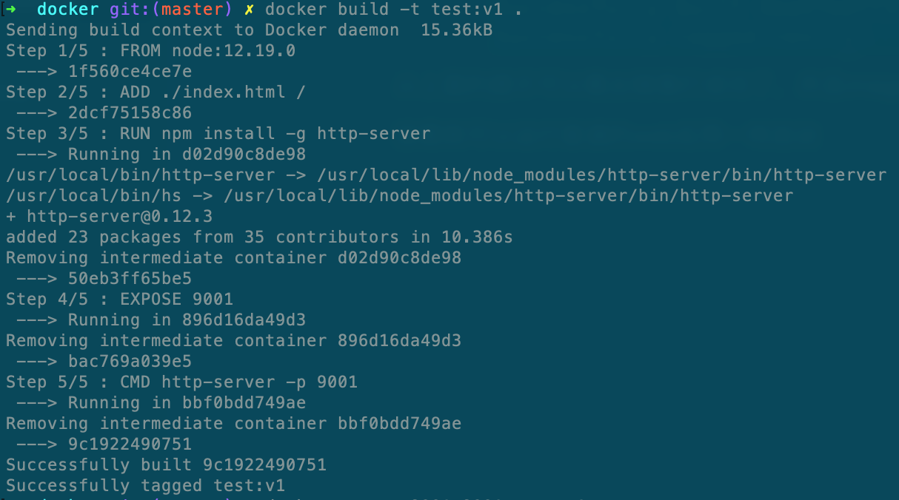

图 6-21

从上面的提示可以看出，镜像打包成功了，并且 image ID 为 9c1922490751， tag 为 v1。我们先看一下本地仓库的镜像情况，并确认一下新容器，如图 6-22 所示。

```shell
docker images
```

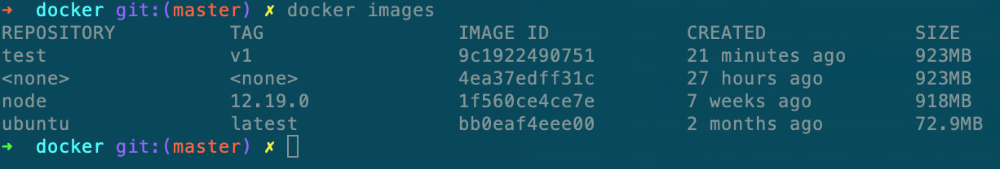

图 6-22

确认镜像没有问题之后，运行下面的命令看看能否实现我们最初的目标，如图 6-23 所示。

```shell
docker run -p 9001:9001 test:v1
```

  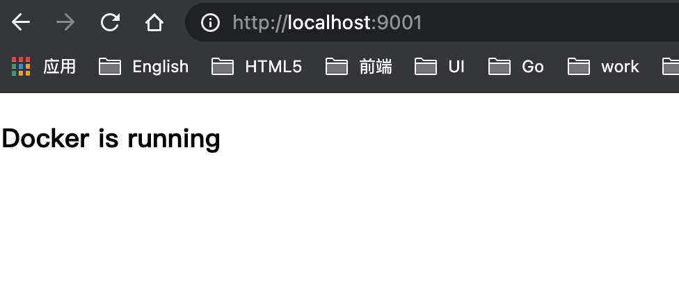

图 6-23

## 6.4 用 WebAssembly 提高前端性能

### 6.4.1 WebAssembly 概述

2018 年 7 月，WebAssembly 1.0 标准正式发布。WebAssembly 的诞生意义非凡，它提供了一种可能性，使各种语言编写的代码都可以以接近原生的速度在 Web 端运行。它使得 Web 能力有了进一步的延伸，解锁了前端开发的新技能，使 Web 开发进入一个新阶段。现在的 Web 端不仅有 HTML、CSS 和 JavaScript，还可以加入 C、C++、Rust、Go、Dart、Kotlin 等开发语言，把这些语言开发的代码转换成.wasm 模块，然后把.wasm 模块转成 base64，然后在浏览器里面执行。.wasm 模块中的字节码既可以编译成机器码后执行，也可以使用解释器直接执行，兼容性和性能兼有。

WebAssembly 是一种新兴的网页虚拟机标准，是一个可移植、体积小、加载快并且兼容 Web 的全新格式。为什么该技术能成为 Web 端性能优化的关键技术之一呢？下面介绍它的产生背景和过程。

众所周知，计算机只能识别机器码，而编译器可以把编程语言编写的程序转变成机器码。根据编译方式的不同，编程语言可以分为解释型语言和编译型语言。

解释型语言每次执行程序时都需要一边转换一边执行，即代码执行到哪里，就将哪里的代码转换成机器码，对于用不到的代码则不进行任何处理。因为每次执行程序都需要重新转换代码，所以解释型语言的执行效率低、速度慢。

编译型语言在执行时是先用编译器把整个源代码全部编译成目标代码，然后直接在支持目标代码的平台上运行，而且可以无限次运行，这样在执行时就不再需要编译器了。比如，Java 代码会被编译成 class 文件。

解释器和编译器各有利弊，具体如下：

解释器的优点是启动和执行的速度更快，不需要等待整个编译过程完成就可以运行代码。也就是说，解释型语言可以从第一行代码就开始“翻译”，对于 Web 开发人员来说，能够快速执行代码并且看到结果是非常过瘾的一件事情。

解释器的缺点是每次执行代码都需要解释，也就是说，解释器不得不一次又一次的“干活”，而这势必会影响代码的执行效率。

编译器的问题则恰好相反，它需要花更多的时间对整个源代码进行编译，然后生成目标文件。即便代码中有循环，它的执行速度也很快，因为它不需要重复编译。

1.JIT 编译器

JavaScript 一开始是解释型语言，为了提高它的执行速度， Google 公司于 2009 年在 v8 引擎 （JavaScript 的解释器）中引入了即时编译 （Just-In-Time ，JIT）编译器。 有了它，JavaScript 的性能才有了大幅提升。

JIT 编译器结合了解释器和编译器的优点，它在 JavaScript 引擎中增加了一个监视器（也叫分析器）。监视器监控着代码的运行情况，记录代码一共运行了多少次、是如何运行的等信息。如果某段代码运行了数次，就把这段代码标记成“warm”。如果某段代码运行了很多次，就把这段代码标记成“hot”。

2.基线编译

如果一段代码被标记成“warm”，那么 监视器就就把它发送到 JIT 编译器去编译，并把编译结果存储起来。代码段的每一行代码都被编译成一个“桩”（stub），同时给这个桩分配一个“行号 + 变量类型”的索引。如果监视器监视到了需要执行同样的代码和同样的变量类型，就直接把这个已编译的版本推送给浏览器，从而提高执行速度。除此之外，还可以通过优化编译器来更有效地执行代码。

3.优化编译器

如果一段代码段被标记成“ hot”，那么监视器就把它发送到优化编译器去编译，生成一段更高效的代码并存储起来。

在引入 JIT 编译器之后，虽然 JavaScript 的执行速度提高了 20~50 倍，但是 JIT 编译器带来的性能提升很快就到了天花板。实际上，JIT 编译器的问题如下：

（1）JIT 编译器是基于运行期进行分析和编译的，而 JavaScript 是一个弱类型的语言，所以大部分时间，JIT 编译器都在推测 JavaScript 中的类型，比如下面代码实现的两个参数的相加。

```js
function add(a, b) {
  return a + b
}
var result = add(1, 2)
```

当 JIT 编译器分析到这块段代码时，会把 add 方法编译为

```js
function add(int a, int b) {
  return a+b
}
```

如果换成了

```js
var result = add(“hello”, “world”)
```

则 JIT 编译器只能重新编译。整数加法和字符串连接是两个完全不同的操作，会被编译成不同的机器码。

JIT 编译器处理这个问题的方法是编译多基线桩。如果一个代码段是单一形态的（即总是以同一类型被调用），则只生成一个桩。如果一个代码段是多形态的（即在调用的过程中，类型不断变化），则会为操作所调用的每一个类型组合生成一个桩。

在 WebAssembly 之前，已有许多大厂不断尝试在浏览器中直接运行 C 或 C++程序。如 1995 年的 NPAPI（Netscape Plugin API）,微软在浏览器直接嵌入可以运行本地代码的 ActiveX 控件，甚至 2010 年 Google 也开发了一种名叫 NaCL（Native Clients）,遗憾的是这些技术实现都太过复杂导致推广受阻，最后都不了了之。

受上面项目失败的影响，Google 公司另辟蹊径，尝试将 Java 转换为 JavaScript，因此推出了 GWT（Google Web Toolkit），开创了将其他语言转为 JavaScript 代码的先河。之后的 CoffeeScript、Dart 和 TypeScript 等语言都以输出 JavaScript 代码为最终目标。

Mozilla 创建了 Emscripten 项目，尝试通过 LLVM 工具链将 C 或 C++语言编写的程序转译为 JavaScript 代码，利用 LLVM 编译器前端编译 C/C++，生成 LLVM 特有的跨平台中间代码，最终再将 LLVM 跨平台中间语言代码转译为 JavaScript 的 asm.js 子集。

2015 年 6 月，谋智公司在 asm.js 的基础上发布了 WebAssembly 项目，随后谷歌、微软、苹果等各大主流的浏览器厂商均大力支持。WebAssembly 不仅拥有比 asm.js 更高的执行效能，而且由于使用了二进制编码等一系列技术，使得 WebAssembly 编写的模块体积更小且解析速度更快。

到目前为止，桌面浏览器对 WebAssembly 的支持情况如下，除 IE 外，其他主流浏览器都已经支持 WebAssembly，如图 6-24 所示。

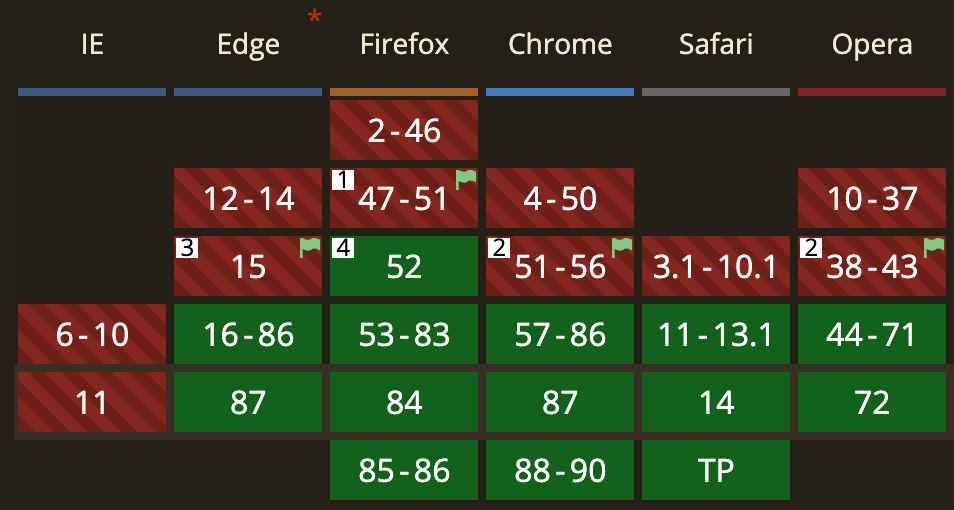

图 6-24

WebAssembly 可以把 Go、Java 等语言编写的程序转换为 JavaScript 语言，那么对于前端而言，在特定场景下，使用 WebAssembly 可以为应用开发提供一种解决方案：

（1）计算密集型的应用，对于高度并行且精度较高的算法，可以使用 WebAssembly 在 CPU 上直接运行。

（2） 区块链应用，Ethereum 已经在核心库中加入 了 WebAssembly，叫作 ewasm，用来确定子集重新设计以太坊智能合约执行层的提议。

（3）IoT。

（4）多媒体应用。

（5）Web 游戏。

（6）深度学习。

### 6.4.2 WebAssembly 案例

本节我们通过两个简单的例子，讲解把 Go 语言程序编译成 WebAssembly 的操作过程，并详细介绍如何利用 WebAssembly 和 DOM 交互，抛砖引玉，希望能引起更多的程序员去探索 Go 语言，探索 WebAssembly，拓展前端的技能圈。

既然是以 Go 语言为蓝本，我们还是有必要对 Go 语言做简单的介绍。

Go 语言是由 Google 开发的一种编译型语言，同时它又是强类型的，天然支持并发性、垃圾回收，总体说来，它具有以下优点：

（1）静态类型检查，有过动态语言开发经验的同学会深有感触静态检查有多么的重要，可以在编译时进行语法检查，能避开很多不必要的错误。

（2）语言级别的并发支持，这个是 Go 语言骨子里的东西，因为 Go 语言本身支持 goroutine 和管道，可以并行执行并支持 goroutine 之间安全的数据通信，避免了像其他语言里共享内存访问引起的问题。

（3）丰富的标准库，Go 语言内置了很多的标准库，特别是网络库，功能强大。

（4）编译速度快。官方编译器在期初是用 C 语言写的，后面使用 Go 进行了重写。并且可以跨平台编译成目标二进制文件。

（5）类型系统简单。由于 Go 语言的作者都是 C 语言出身，所以和 C 的语言结构比较相似。

除此之外，Go 语言还内置了强大的工具链，拥有高性能 HTTP Server、defer 机制等。

Go 语言可以做的应用大致可归结为以下几类：

服务器编程。C 和 C++适合做的事情，用 Go 来做也合适。

分布式系统开发，及其他辅助系统开发。如百度和京东的消息系统、京东商城、小米的运维监控系统和日志搜索系统，以及腾讯游戏。在国外更是有很多成功的 Go 项目，如 nsq 消息队列、k8s 为 Docker 应用部署、规划、更新、维护服务。Doozer 分布式同步工具，类似 ZooKeeper。groupcache、memcahe 作者写的用于 Google 下载系统的缓存系统。还有很多，大家可以自行搜索。

Web 编程。这块的应用目前最为广泛。Web 开发在当前仍然是热门职位，所以，Go 语言的 Web 开发框架也不会缺席，beego、buffalo、echo、gin、iris、revel。在国内以 beego 为口碑最佳。

云平台，目前国外很多云平台在采用 Go 开发，CloudFoundy 的部分组建。

> 注：本章节并非介绍 Go 语言的入口，所以暂不介绍 Go 语言的安装、环境配置等基本操作，我们直接从实际操作入手。

第 1 步，新建一个 Go 工程，工程目录大致如图 6-25 所示。

  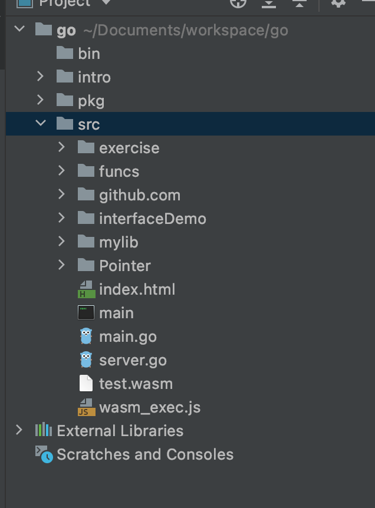

图 6-25

bin：存放编译后的可执行文件。

pkg：存放编译后的包文件。

src：存放项目源文件。

intro：自定义目录，用来测试第一个 WebAssembly。

第 2 步，在 src 目录下，建立一个 go 文件，命名为 main.go。

```go
package main
import "fmt"

func main() {
	fmt.Println("Hello, WebAssembly!")
}

```

main.go 是主程序的入口，主入口程序有两个比较明显的特征，一个是声明的 main 方法，编译器会把这个名字的包编译成二进制可执行文件，如果没有这个方法，程序就无法执行；另一个是在第一行声明的包名

```go
package main
```

在 Go 语言中，每行代码都要归属到某一个包中，main.go 也不例外。包定义了一组编译过的代码，与命名空间比较类似，可用来间接地访问包内声明。

第 3 步，导入 fmt 包。这个包提供了完整格式化的功能，在 main 方法中，我们只打印“Hello, WebAssembly!”这一句话。

前面介绍过，我们可以把 Go 代码编译为 WebAssembly。想要实现编译其实很简单。

先试试下面的命令：

```shell
GOOS=js GOARCH=wasm go build -o test.wasm main.go
```

这里需要说明的是 GOOS 和 GOARCH 这两个环境变量的作用。 在 Go 里面，可以将 Go 代码编译成各个平台的目标结果。比如 GOOS，可以指定为 Windows、Linux，Android、illumos、Solaris，netbsd、js 等。GOARCH 表示系统架构，可以指定为 Arm, Amd64,wasm 等。

-o 表示 output，是输出文件，输出文件名紧跟该选项，如果想把文件直接编译到某个目录下，则可以指定具体的目录。例如，想要编译到当前的 test 文件夹中，可以指定为'./test/test.wasm'。在上面的命令中，输入的文件名为 test.wasm。最后的选项为需要编译的源文件。

现在我们有了 wasm 文件，还有一个比较重要的步骤就是需要在 HTML 中引入 Go 提供的 js 库。值得欣喜的是，Go 语言开发者已经帮我们准备好了，就位于$GOROOT/misc/wasm 下，只要正确配置 GOPATH，剩下的只需执行一条命令即可：

```shell
cp "$(go env GOROOT)/misc/wasm/wasm_exec.js" .
```

通过该命令就可以把核心库文件拷贝到当前目录或者指定目录了。

至此，准备工作就做好了。需要 html 的的时候了。为了和 Go 语言的源代码分开，下面新建一个 intro 目录，把 wasm 文件和 js 核心库文件拷贝到该目录下，并在 HTML 文件中准备以下内容：

```html
<!DOCTYPE html>
<html>
  <head>
    <meta charset="utf-8" />
    <title>wasm 介绍</title>
    <script type="text/javascript" src="./wasm_exec.js"></script>
  </head>
  <body>
    <h1>Chapter6</h1>
    <h3>compile Go to webassembly</h3>
    <script>
      const go = new Go()
      WebAssembly.instantiateStreaming(
        fetch('./test.wasm'),
        go.importObject
      ).then((result) => {
        go.run(result.instance)
      })
    </script>
  </body>
</html>
```

代码中使用的 WebAssembly.instantiateStreaming 方法可以直接从流式底层源编译和实例化 WebAssembly 模块，正常的流程是先转换成 ArrayBuffer，再进行实例化。如果要分步实现，则支持数字相加之后再平方的代码初始化是这样的：

```html
WebAssembly.compile(new Uint8Array(` 00 61 73 6d 01 00 00 00 01 0c 02 60 02 7f
7f 01 7f 60 01 7f 01 7f 03 03 02 00 01 07 10 02 03 61 64 64 00 00 06 73 71 75 61
72 65 00 01 0a 13 02 08 00 20 00 20 01 6a 0f 0b 08 00 20 00 20 00 6c 0f
0b`.trim().split(/[\s\r\n]+/g).map(str => parseInt(str, 16)) )).then(module => {
const instance = new WebAssembly.Instance(module) const { add, square } =
instance.exports console.log('3 + 6 =', add(3, 6)) console.log('3^2 =',
square(3)) console.log('(9 + 1)^2 =', square(add(9 + 1))) })
```

[WebAssembly.compile](http://webassembly.org/docs/js/#webassemblycompile) 可以用来编译 wasm 的二进制源代码，它接受 BufferSource 格式的参数，返回一个 Promise，所以我们使用 Uint8Array 把字符串转换成 ArrayBuffer，即把字符串先分割成数组，再将普通数组转成 8 位无符号整数的数组。

```js
new Uint8Array(
  `...`
    .trim()
    .split(/[\s\r\n]+/g)
    .map((str) => parseInt(str, 16))
)
```

了解了上面的处理方式，就不难理解为什么通过 instantiateStreaming 加载 wasm 代码比较高效了。

根据规范，instantiateStreaming 接收两个参数：

```go
dictionary WebAssemblyInstantiatedSource {
   required WebAssembly.Module module;
   required WebAssembly.Instance instance;
};

Promise<InstantiatedSource> instantiateStreaming(source [, importObject])
```

**source**： 一个 Response 或者 Promise 对象。

**importObject**： 包含一些想要导入新创建 Instance 中值的对象，这样在 wasm 的模块中就可以访问到 js 对象。

instantiateStreaming 返回一个 Promise，通过 resolve 返回的对象包含两个对象，module 和 instance，module 表示编译完成的 WebAssembly 模块. 这个 Module 能够再次被实例化（WebAssembly.Instance）或 通过[postMessage()](https://developer.mozilla.org/en-US/docs/Web/API/Worker/postMessage)共享。instance 包含 WebAssembly 所有公开方法（Exported WebAssembly functions），这些函数基本上只是 webassembly 中 Javascript 的包装器。 被调用时，用户侧在后台得到一些技能加持，将参数转换为 wasm 可以使用的类型(例如将 Javascript 的 number 转换为 Int32 类型的)，将参数传给 wasm 模块内部的函数，当函数被调用，结果转换并回传给 Javascirpt。

此时还是无法执行 html 文件，因为前端跨域还需要一个服务器。继续在 src 目录下新建一个 server.go。新建 go 服务器时我们需要两个关键包：flag 包和 http 包。

在启动命令行程序（工具、Server）时，有时需要对命令参数进行解析，这时就需要用到 flag 包。如果要创建 HTTP 服务，那么 http 包就是必选项。

下面先介绍一下这两个包的基本用法，以便理解服务器代码。

flag 包的基本用法

常用的定义命令行 flag 参数的方法有两种，第一种：

```go
flag.Type(flag 名, 默认值, 帮助信息) *Type
```

Type 可以是 Int、String 或 Bool 等，返回值为一个相应类型的指针。例如，我们要定义姓名、年龄两个命令行参数，则可以按如下方式定义：

```go
name := flag.String("name", "houyw", "姓名")
age := flag.Int("age", 36, "年龄")
```

需要注意的是，此时 name 和 age 均为对应类型的指针，而不是具体的值。

第二种：

```go
flag.TypeVar(Type 指针, flag 名, 默认值, 帮助信息)
```

TypeVar 可以是 IntVar、StringVar 或 BoolVar 等，其功能是将 flag 绑定在一个变量上。例如，我们要定义姓名、年龄两个命令行参数，则可以按如下方式定义：

```go
var name string
var age int
flag.StringVar(&name, "name", "houyw", "姓名")
flag.IntVar(&age, "age", 36, "年龄")
```

还有一个比较重要 flag.parse()，通过以上两种方法定义命令行 flag 参数后，必须调用 flag.Parse() 对命令行参数进行解析。

启动一个 HTTP 服务，可以调用 ListenAndServe 来实现。

通过这两个简单的包即可实现一个简单的 server.go:

```go
package main

import (
	"flag"
	"log"
	"net/http"
)

var (
	listen = flag.String("listen", ":9002", "listen address")
	dir    = flag.String("dir", "../intro", "directory to serve")
)

func main() {
	flag.Parse()
	log.Printf("listening on %q...", *listen)
	err := http.ListenAndServe(*listen, http.FileServer(http.Dir(*dir)))
	log.Fatalln(err)
}

```

万事俱备，现在启动服务，如图 6-26 所示。

```go
go run server.go
```

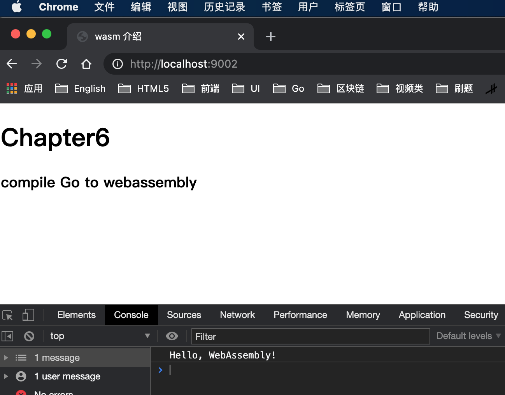

图 6-26

终于成功了。

提到 Web 开发，Dom 操作是常规操作，getElementById、getElementsByClass 是核心 API，那么在 WebAssembly 中是如何实现这种最基本的交互呢。下面我们再通过一个例子实现。

Dom 操作需要导入另一个 js 相关的包，即 syscall/js。该包提供了操作 Dom 的底层 API：

```go
import (
	"fmt"
	"syscall/js"
	"time"
)
```

`js.Global()`返回一个`js.Value`类型的结构体，它指代 JS 中的全局对象，在浏览器环境中即为`window`对象。可以通过其`Get()`方法获取`window`对象中的字段，也是`js.Value`类型，包括其中的函数对象，并使用其`Invoke()方法调用 JS 函数。

| Go                     | JavaScript  |
| ---------------------- | ----------- |
| js.Value               | [its value] |
| js.Func                | function    |
| nil                    | null        |
| bool                   | boolean     |
| integers and floats    | number      |
| string                 | string      |
| []interface{}          | new array   |
| map[string]interface{} | new object  |

```go
win := js.Global()
doc := win.Get("document")
body := doc.Get("body")
```

在执行上面的代码后，变量 win 就指向 window 对象，可以像普通的 JavaScript 对象一样在该对象上挂载属性或者方法。变量 doc 指向 document 对象，body 指向 body 对象。

现在，我们使用 set 方法给 window 对象上挂载一个方法 MyGoFunc，这样在 html 页面中就可以直接调用这个方法了。

```go
win.Set("MyGoFunc", MyGoFunc())
```

在 main.go 中定义一个 MyGoFunc 方法。

```go
func MyGoFunc() js.Func {
	return js.FuncOf(func(this js.Value, args []js.Value) interface{} {
		return map[string]interface{}{
			"hello":  "myGoFunc invoked ",
			"name": "houyw",
		}
	})
}
```

Go 中的函数必须是 func(args []js.Value) 形式的，它使用 args 参数接收 JavaScript 调用的参数。稍后我们在 HTML 页面中测试效果。

在常规的 DOM 操作中，我们总是使用 document.getElementById 来获得 DOM 元素，下面看看在 syscall/js 中应该怎么做。在上面的代码中，变量 doc 指向 document 对象，如果要获得

```html
<button id="test">click me</button>
```

中的 Dom 元素，则可以使用 doc 的 Get 方法：

```go
btn := doc.Call("getElementById", "test")
```

绑定事件可以像普通的 DOM 对象一样，如图 6-27 所示。

```go
var callback js.Func
callback = js.FuncOf(func(this js.Value, args []js.Value) interface{} {
  fmt.Println("click invoke")
  fmt.Println(args)
  btn.Set("innerHTML", "changed by go")
  return nil
})
btn.Call("addEventListener", "click", callback)
```

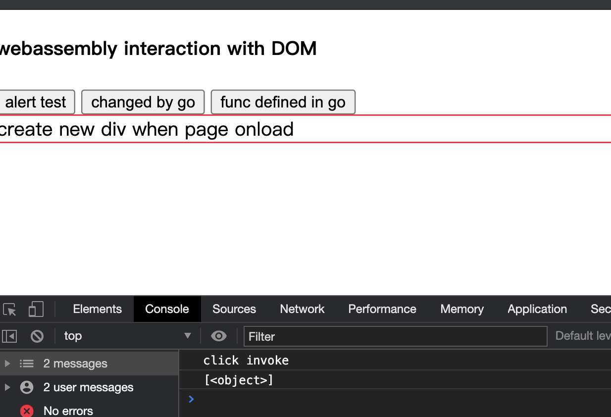

图 6-27

在事件执行过程中，把原来显示的“click me”变成了“changed by go”。下面测试一下在 window 对象上绑定的方法 MyGoFunc，看是否能调用到，如图 6-28 所示。

```html
<button onclick="handleGoFunc()">func defined in go</button> function
handleGoFunc() { console.log(MyGoFunc()) }
```

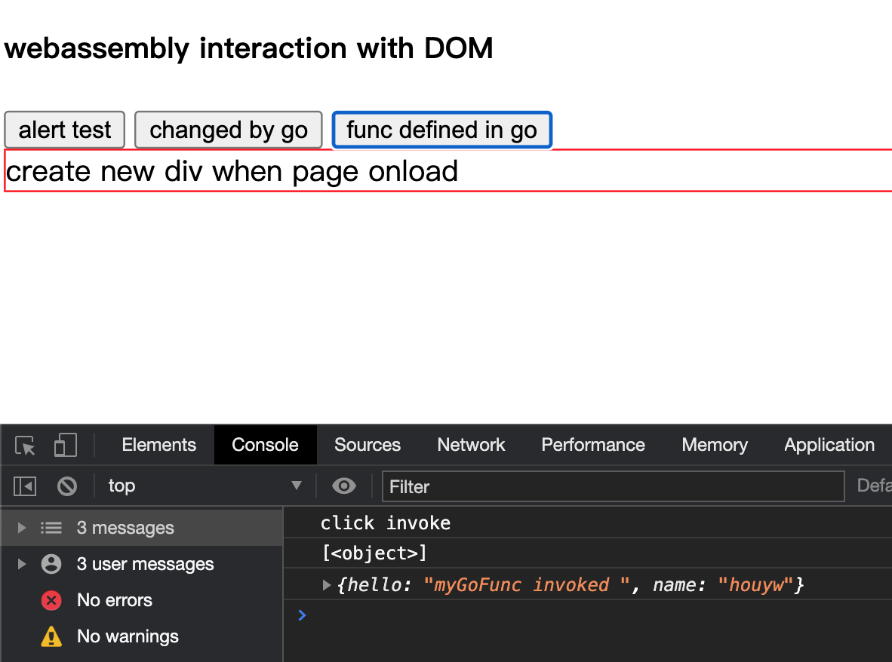

图 6-28

没错，这就是我们想要的结果。

如何动态创建一个元素呢？使用 doc.call 调用底层的 Dom 方法，并传入元素名，接着就是常规操作，设置样式，最后把新建的元素追加到父节点上。

```go
newDiv := doc.Call("createElement", "div")
newDiv.Set("innerHTML", "create new div when page onload")
newDiv.Set("style","border: 1px solid red")
body.Call("appendChild", newDiv)
```
